# Báo cáo HW01 — Việc làm QA/QC, 20 lỗi phần mềm và kiểm thử sản phẩm vật lý

**Môn học:** CSC13003 — Kiểm thử phần mềm (tăng cường bởi AI, 2026)  
**Mã bài tập:** HW01-AI  
**Họ và tên:** Tống Dương Thái Hòa  
**MSSV:** 23120262   
**Lớp / Khoá:** Software Testing - CQ2023/3  
**Kho mã nguồn GitHub:** https://github.com/henry-banana/software-testing-hw01-qa-qc-jobs

---

## 1. Thị trường việc làm QA/QC 2026+ (40 điểm)

### 1.1. Tổng quan

Mười tin tuyển dụng dưới đây được quan sát trên LinkedIn ngày 29/09/2026. Sáu vị trí nêu trực tiếp AI/LLM hoặc kiểm thử có AI hỗ trợ, cao hơn yêu cầu tối thiểu ba vị trí. Tuổi tin được ghi theo thông tin hiển thị tại thời điểm thu thập và toàn bộ tin nằm trong phạm vi 60 ngày.

| STT | Công ty | Vị trí | Tuổi tin khi thu thập | Yêu cầu AI/LLM | Mức lương |
|---:|---|---|---|:---:|---|
| 1 | Trusting Social | QA Engineer: Full-Stack AI Engineering | Khoảng 6 ngày | Có | Không công bố con số |
| 2 | Ins Enco | Senior QA Engineer (AI-Augmented Quality Engineering) | Khoảng 1 tuần | Có | 30–40 triệu VND trước thuế/tháng |
| 3 | PILLAR | QA Engineer (AI focused) | Khoảng 1 giờ | Có | Không công bố con số |
| 4 | SCC Vietnam | AI Quality Assurance Tester (Data Testing) | Khoảng 4 tuần | Có | Không công bố con số |
| 5 | Money Forward Vietnam | Senior QA Engineer (Hybrid, AI, Data) | Khoảng 1 ngày | Có | Không công bố con số |
| 6 | Home Credit Vietnam | Quality Assurance Automation Engineer | Khoảng 2 tuần | Có | Không công bố con số |
| 7 | Corsair | Software QA Engineer | Khoảng 1 tuần | Không nêu trực tiếp | Không công bố |
| 8 | Razer | QC Engineer | Khoảng 1 ngày | Không nêu trực tiếp | Không công bố |
| 9 | CMC Global | QA/QC Engineer | Khoảng 13 phút | Không nêu trực tiếp | Không công bố lương cơ bản |
| 10 | Aperia | (Senior/Middle) QA Engineer | Khoảng 1 tuần | Không nêu trực tiếp | Không công bố con số |

### 1.2. Vị trí 01 — Trusting Social

- **Liên kết:** https://www.linkedin.com/jobs/view/qa-engineer-full-stack-ai-engineering-hcmc-at-trusting-social-4448937255
- **Thông tin cơ bản:** QA Engineer: Full-Stack AI Engineering; Thành phố Hồ Chí Minh; toàn thời gian; cấp trung-cao; quan sát khoảng 6 ngày sau đăng; yêu cầu liên quan AI: **Có**.
- **Lương/phúc lợi:** Không công bố con số; tin nêu mức đãi ngộ cạnh tranh, lương tháng 13 và thưởng hiệu suất.
- **Mô tả:** QA Engineer chịu trách nhiệm chất lượng đầu cuối: thiết kế kiểm thử, tự động hóa, phân tích lỗi, xác minh phát hành, đánh giá rủi ro và quyết định phát hành hay không. Vai trò xây dựng hạ tầng kiểm thử cho API, kiểm thử đầu cuối, thiết bị di động và hồi quy hình ảnh.
- **Kỹ năng:** 3+ năm QA, TypeScript/JavaScript, Node.js, SQL, CI/CD, kiểm thử tự động API/Web/thiết bị di động, kiểm thử khám phá và khả năng đánh giá đầu ra do AI agent tạo ra.
- **Mô tả công việc chi tiết:**

> **Role focus**
>
> A full-stack, AI-native QA engineering role with end-to-end ownership of a product or partner-integration track. The position covers test design, automation, defect root-cause analysis, release verification, risk assessment, and go/no-go decisions. QA is expected to shift quality left and build deterministic test infrastructure rather than operate only as a final release gate.
>
> **Core responsibilities**
>
> - Own quality from test design and automation through defect investigation, verification, and release sign-off.
> - Build automated coverage across API, E2E, mobile, visual/responsive testing.
> - Create deterministic test infrastructure using service mocks, real-to-mock switching, CI gates, and test-data tooling.
> - Instrument tests and CI pipelines to detect coverage gaps and quality drift.
> - Use Claude Code or equivalent agents through a disciplined plan → test-first → verify workflow.
> - Maintain machine-readable domain context and AI-assisted QA systems.
> - Perform exploratory and risk-based testing for migration edge cases and areas automation misses.
> - Investigate defects through production tooling and logs; produce reproducible findings with root-cause evidence.
> - Review specifications and designs early to identify risk before implementation.
>
> **Requirements / preferred background**
>
> - 3+ years in QA engineering with automation across APIs, Web UI, and Mobile.
> - TypeScript/JavaScript (Node) proficiency.
> - Strong SQL and relational-database skills.
> - Bachelor’s in Computer Science/Engineering or equivalent practical experience.
> - Strong English communication.
> - Plus: startup/fast-growth environment; fintech, lending, payments, or eKYC.
> - Plus: mobile automation, visual regression, performance testing, CI/CD, contract/mock testing, observability.
> - Advantage: mentoring peers or delivering reusable test frameworks.
>
> **Named stack / concepts**
>
> `TypeScript` · `JavaScript` · `Node.js` · `SQL` · `Claude Code` · `CI/CD` · `service mocks` · `Datadog` · `Temporal` · `Kafka` · mobile testing · visual regression · performance testing

- **Phân tích tác động của AI:** AI là một phần của quy trình kỹ thuật nhưng không thay thế trách nhiệm sở hữu chất lượng. Con người vẫn phải nhận biết sự trôi mô hình, kết quả xanh giả, rủi ro phát hành và quyết định khi nào không chấp nhận đề xuất của AI.

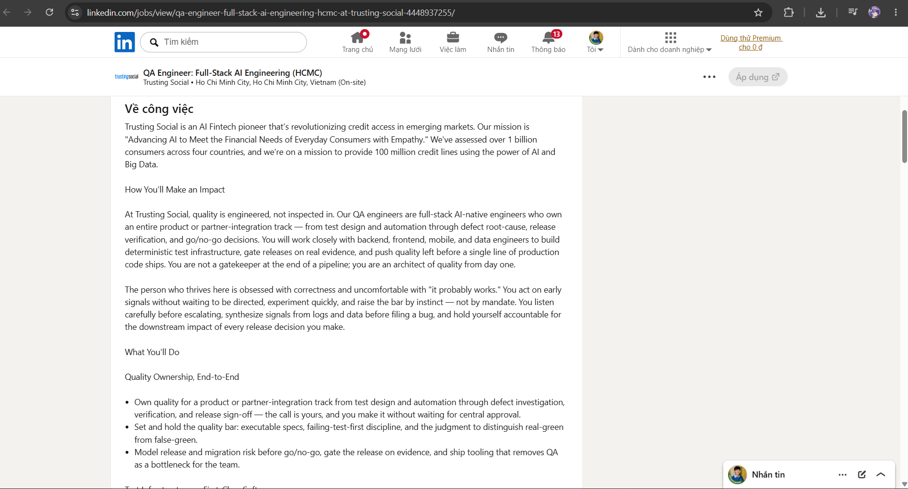

### 1.3. Vị trí 02 — Ins Enco

- **Liên kết:** https://vn.linkedin.com/jobs/view/senior-qa-engineer-ai-augmented-quality-engineering-4466589603
- **Thông tin cơ bản:** Senior QA Engineer (AI-Augmented Quality Engineering); Thành phố Hồ Chí Minh; toàn thời gian tại văn phòng; 3–6 năm kinh nghiệm; quan sát khoảng 1 tuần sau đăng; yêu cầu liên quan AI: **Có**.
- **Lương/phúc lợi:** 30–40 triệu VND trước thuế/tháng tuỳ kinh nghiệm — đây là tin duy nhất trong 10 tin công bố khoảng lương cụ thể.
- **Mô tả:** Kết hợp kiểm thử thủ công, chiến lược kiểm thử, tự động hóa bằng Playwright/API, CI/CD, giám sát và kiểm thử có AI hỗ trợ.
- **Kỹ năng:** 3–6 năm QA, Playwright, Postman/Bruno, REST/GraphQL, SQL, GitHub Actions/Jenkins, Jira, GPT/Claude, Mabl/Testim và Applitools/Percy.
- **Mô tả công việc chi tiết:**

> **Role focus**
>
> Full-cycle quality engineering combining test strategy, automation, CI/CD integration, observability, performance baselining, and AI-powered testing tools. The emphasis is on defect prevention and scalable quality practices.
>
> **Core responsibilities**
>
> - Design test strategy across manual, automated, and AI-assisted layers.
> - Apply shift-left testing to requirements and designs.
> - Perform exploratory, risk-based, and session-based testing.
> - Build Playwright E2E suites and API collections with Postman/Bruno.
> - Integrate automated tests into GitHub Actions/Jenkins pipelines.
> - Implement AI self-healing testing using Mabl/Testim.
> - Set up visual-regression testing with Applitools/Percy.
> - Use GPT/Claude for test-case generation, edge cases, test data, failure-log analysis, and root-cause support.
> - Use Postbot for AI-generated API tests.
> - Monitor production quality with Sentry/Datadog.
> - Produce quality metrics and test reports.
> - Run performance baselines with k6/Lighthouse CI.
>
> **Requirements**
>
> - 3–6 years in QA / Quality Engineering.
> - Strong Playwright experience, including CI integration and tracing.
> - API testing with Postman/Bruno; REST and GraphQL.
> - SQL/database validation.
> - Git and CI/CD experience.
> - Jira + Xray/Zephyr.
> - Agile experience.
> - AI-essential: GPT/Claude, Mabl/Testim, Applitools/Percy, Postbot workflows.
> - Nice to have: k6/Artillery, OWASP ZAP/Snyk, Sentry/Datadog, ISTQB.
>
> **Named stack**
>
> `Playwright` · `Postman` · `Bruno` · `REST` · `GraphQL` · `GitHub Actions` · `Jenkins` · `Mabl` · `Testim` · `Applitools` · `Percy` · `GPT` · `Claude` · `Postbot` · `Sentry` · `Datadog` · `k6` · `Lighthouse CI`

- **Phân tích tác động của AI:** AI trở thành năng lực được yêu cầu trực tiếp ở cấp QA cao cấp. Tuy vậy, chiến lược kiểm thử, kiểm thử dựa trên rủi ro và cổng chất lượng vẫn cần phán đoán của kỹ sư.

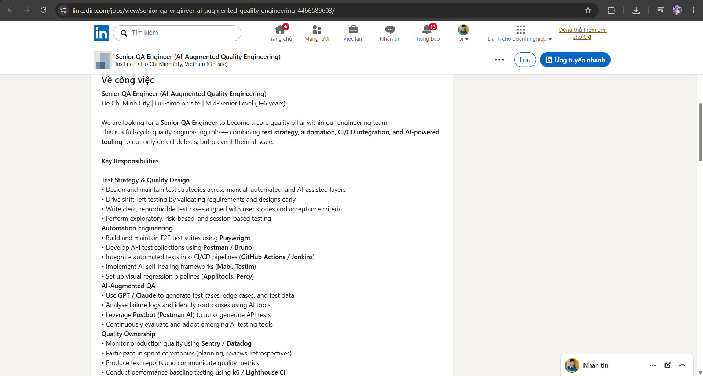

### 1.4. Vị trí 03 — PILLAR

- **Liên kết:** https://vn.linkedin.com/jobs/view/qa-engineer-ai-focused-at-pillar-4469674127
- **Thông tin cơ bản:** QA Engineer (AI focused); Thành phố Hồ Chí Minh; toàn thời gian; quan sát khoảng 1 giờ sau đăng; yêu cầu liên quan AI: **Có**.
- **Lương/phúc lợi:** Không công bố con số; tin nêu mức đãi ngộ cạnh tranh và lương tháng 13.
- **Mô tả:** Kiểm thử sản phẩm tài chính có AI, phân tích yêu cầu, tái hiện lỗi, xác minh bản sửa và dùng GenAI để sinh ca kiểm thử/dữ liệu kiểm thử, tìm trường hợp biên và lỗ hổng logic.
- **Kỹ năng:** 3+ năm kiểm thử web, kiểm thử thủ công, SQL, SDLC/STLC, Agile, ChatGPT/Claude, kỹ thuật prompt; API/lập trình và kinh nghiệm kiểm thử LLM là lợi thế.
- **Mô tả công việc chi tiết:**

> **Role focus**
>
> QA for an AI-enabled mortgage infrastructure product. The role combines strong manual testing with AI-assisted test design, test-data generation, edge-case discovery, and quality validation for complex financial processes.
>
> **Core responsibilities**
>
> - Derive test requirements from PRDs and Designs.
> - Use AI-assisted tools to discover edge cases and logic gaps early.
> - Use Generative AI to accelerate test-case generation, test-data preparation, and coverage design.
> - Validate functional and design specifications.
> - Identify quality risks throughout development and escalate material issues.
> - Isolate, reproduce, report, and verify defects.
> - Test complex financial workflows and Cloud Native services.
> - Act as a quality gate while continually improving the team’s quality bar.
>
> **Requirements**
>
> - 3+ years testing web-based applications.
> - Strong manual testing techniques.
> - SQL testing experience.
> - Understanding of product-development lifecycle, testing lifecycle, design thinking, and Agile.
> - Good English communication and cross-functional collaboration.
> - Ability to work independently.
> - Hands-on use of AI tools such as ChatGPT and Claude for QA work.
> - Highly valued: prompt engineering for QA, testing AI/LLM-integrated features, TypeScript or another programming language, API testing, ISTQB.
>
> **AI-specific areas**
>
> AI-assisted test generation · synthetic/complex test data · logic-gap discovery · chatbot/model-behavior validation · data privacy considerations · prompt engineering

- **Phân tích tác động của AI:** AI làm tăng tốc việc đề xuất ý tưởng kiểm thử và chuẩn bị dữ liệu, nhưng người kiểm thử vẫn chịu trách nhiệm xác minh logic nghiệp vụ tài chính và tính đầy đủ của độ bao phủ.

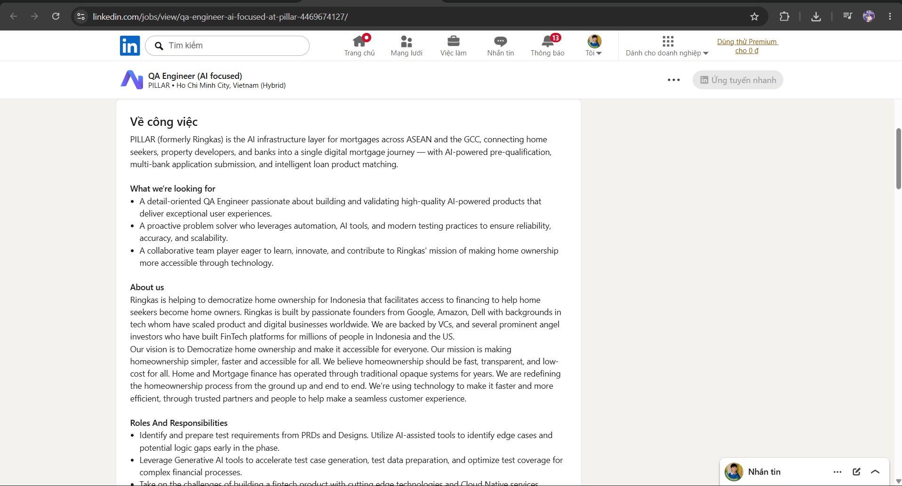

### 1.5. Vị trí 04 — SCC Vietnam

- **Liên kết:** https://www.linkedin.com/jobs/view/4459648611/
- **Thông tin cơ bản:** AI Quality Assurance Tester (Data Testing); khu vực đô thị Thành phố Hồ Chí Minh; toàn thời gian; quan sát khoảng 4 tuần sau đăng; yêu cầu liên quan AI: **Có**.
- **Lương/phúc lợi:** Không công bố con số; tin nêu mức thù lao cạnh tranh, thưởng hiệu suất và lương tháng 13.
- **Mô tả:** Kiểm thử trợ lý bán hàng AI Scout: độ chính xác hội thoại, hợp nhất dữ liệu, đầu ra chuẩn bị cuộc họp, ghi nhận nguồn, xử lý xung đột, xác thực, ánh xạ, chuẩn hóa và xử lý lỗi.
- **Kỹ năng:** 2–4 năm kiểm thử phần mềm/AI, kiểm thử thủ công/tự động, dữ liệu kiểm thử, giao diện hội thoại, luồng dữ liệu, Microsoft Teams/Azure/CRM, quản trị AI và tuân thủ.
- **Mô tả công việc chi tiết:**

> **Role focus**
>
> Manual/automated QA focused on the correctness, reliability, compliance, and data behavior of an AI sales assistant. Testing spans conversational accuracy, data consolidation, AI conflict resolution, integrations, auditability, and EU AI Act-related controls.
>
> **Core responsibilities**
>
> - Support Test Lead with quality matrix, entry/exit criteria, daily status, and completion reports.
> - Perform SIT/FAT and functional testing.
> - Validate chat interactions and structured account insights for accuracy and completeness.
> - Test data consolidation from ZoomInfo, Sales Hub/CRM, public sources, and the Knowledge Graph.
> - Validate meeting-preparation summaries, stakeholder profiles, signals, talking points, and role-play simulations.
> - Verify conflict-resolution rules based on priority, recency, and confidence thresholds.
> - Verify conflict-resolution logs, source attribution, transparency, human oversight, and compliance expectations.
> - Test adapters for authentication, field mapping, normalization, error handling, and multi-market scalability.
> - Perform defect reporting, root-cause support, estimation, planning, and Agile ceremonies.
>
> **Requirements / stack**
>
> - Bachelor’s in CS/Engineering/Information Systems or equivalent experience.
> - 2–4 years software or AI testing.
> - Microsoft Teams, Azure AI/Cloud, CRM familiarity.
> - Experience with conversational interfaces, data pipelines, or AI applications.
> - Understanding of data governance and AI compliance.
> - Agile, SIT/FAT, stakeholder management, release/project management.
> - Multi-platform/browser/device testing and root-cause analysis.

- **Phân tích tác động của AI:** Kiểm thử hệ thống AI mở rộng tiêu chuẩn đánh giá từ đầu ra xác định sang độ chính xác, tính minh bạch, nguồn gốc dữ liệu, tuân thủ và giám sát của con người.

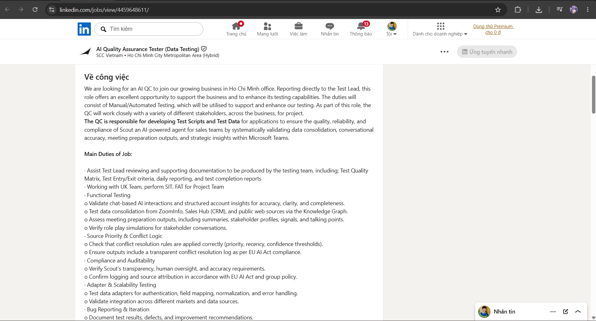

### 1.6. Vị trí 05 — Money Forward Vietnam

- **Liên kết:** https://www.linkedin.com/jobs/view/4451527480/
- **Thông tin cơ bản:** [IDM] Senior QA Engineer (Hybrid, AI, Data); Thành phố Hồ Chí Minh; toàn thời gian, cấp trung-cao; quan sát khoảng 1 ngày sau đăng; yêu cầu liên quan AI: **Có**.
- **Lương/phúc lợi:** Không công bố con số; tin nêu nhận đủ lương trong thời gian thử việc, lương tháng 13, bảo hiểm và đánh giá lương/hiệu suất hai lần mỗi năm.
- **Mô tả:** Chịu trách nhiệm chất lượng cho nền tảng dữ liệu và ứng dụng; gồm lập kế hoạch kiểm thử, kiểm thử khám phá/chức năng/hồi quy/tích hợp/API, tự động hóa và hướng dẫn thành viên ít kinh nghiệm. Vai trò phối hợp với kỹ sư AI để đánh giá đầu ra LLM.
- **Kỹ năng:** 5+ năm kiểm thử, TypeScript/Python, tự động hóa API, ISTQB, tiếng Anh, phát hiện nội dung bịa đặt và rủi ro prompt injection.
- **Mô tả công việc chi tiết:**

> **Role focus**
>
> Senior QA/QC ownership for an integrated data platform and user-facing applications, working across backend, frontend, data, and AI teams. The role combines traditional QA, automation, API testing, performance/security testing, mentoring, and evaluation of LLM outputs.
>
> **Core responsibilities**
>
> - Analyze requirements, user stories, and technical specifications into detailed test plans/cases.
> - Execute exploratory, functional, regression, integration, and API testing.
> - Build and scale automated tests for Web UI and APIs.
> - Track defects with Jira and improve test coverage/processes.
> - Optimize QA workflows, tools, and testing strategy.
> - Mentor junior QA engineers.
> - Define AI-quality evaluation approaches with AI/data engineers, including hallucination detection, output quality, and user-feedback loops.
>
> **Must-have**
>
> - 5+ years software testing for web and/or mobile.
> - TypeScript or Python for automation.
> - Strong QA methodology and test-design knowledge.
> - API testing via Postman, Insomnia, SoapUI, or scripts.
> - Playwright and Vitest familiarity.
> - CI/CD knowledge and debugging through logs/API responses/basic code.
> - Load/stress/performance testing.
> - Security testing including XSS, SQL injection, OWASP Top 10.
>
> **Nice to have**
>
> Data platforms/pipelines · Go/Shell · TestRail/Zephyr · AWS · AI/ML evaluation · prompt engineering · rubric-based scoring · A/B testing · prompt-injection security · ISTQB

- **Phân tích tác động của AI:** QA phải kiểm thử cả chất lượng lẫn bảo mật của đầu ra LLM; kỹ thuật kiểm thử truyền thống là nền tảng nhưng chưa đủ cho hệ thống xác suất.

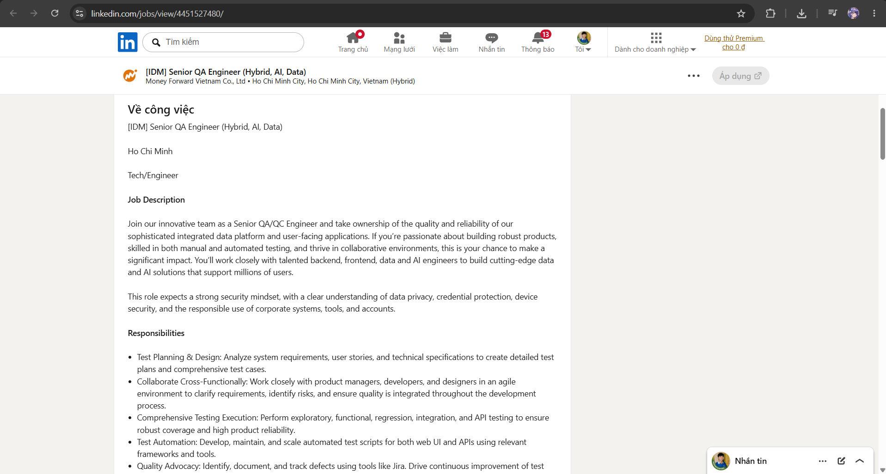

### 1.7. Vị trí 06 — Home Credit Vietnam

- **Liên kết:** https://www.linkedin.com/jobs/view/4439847433/
- **Thông tin cơ bản:** Quality Assurance Automation Engineer; Thành phố Hồ Chí Minh; toàn thời gian; quan sát khoảng 2 tuần sau đăng; yêu cầu liên quan AI: **Có**.
- **Lương/phúc lợi:** Không công bố lương cơ bản; tin nêu lương tháng 13 và thưởng KPI/hiệu suất.
- **Mô tả:** Đảm bảo chất lượng ứng dụng di động qua kiểm thử thủ công, tự động hóa, kiểm thử API/tích hợp, UAT, quản lý lỗi và CI/CD.
- **Kỹ năng:** Kiểm thử iOS/Android, Appium/Selenium/Maestro, Java/TypeScript/C#, SQL, kiểm thử API và sử dụng Copilot/ChatGPT để sinh kịch bản, dữ liệu kiểm thử, phân tích nhật ký và nguyên nhân gốc.
- **Mô tả công việc chi tiết:**

> **Role focus**
>
> Quality ownership for a mobile application, combining manual testing, automation, API/integration testing, CI/CD, and practical use of AI to increase testing efficiency, coverage, and defect detection.
>
> **Core responsibilities**
>
> - Analyze requirements, user stories, and technical designs.
> - Design/execute test cases, test plans, and functional/non-functional scenarios.
> - Perform functional, regression, integration, API testing, and UAT support.
> - Log and track defects in Jira/Azure DevOps.
> - Review requirements for gaps and ambiguities.
> - Collaborate with BA/Product Owner, developers, and QA; participate in Agile ceremonies.
> - Develop automated scripts and integrate them into Azure CI/CD.
> - Use AI to generate tests/test data, support bug analysis and root-cause investigation, analyze logs/API responses, and suggest edge cases.
> - Explore AI agents for mobile testing and automated exploratory testing.
>
> **Requirements**
>
> - 2–5+ years Software Testing / QA.
> - iOS/Android testing.
> - SDLC and Agile/Scrum.
> - API testing with Bruno, Swagger, curl, etc.
> - Appium / Selenium / Maestro.
> - Java, TypeScript, or C#.
> - Basic SQL/database and performance testing.
> - Hands-on AI-tool usage or strong willingness to adopt it.
> - Nice to have: Jira, fintech/banking experience.

- **Phân tích tác động của AI:** AI hỗ trợ công việc lặp lại và phân tích lỗi thực thi, nhưng không thay thế hiểu biết về nền tảng di động, API, khung tự động hóa và rủi ro nghiệp vụ.

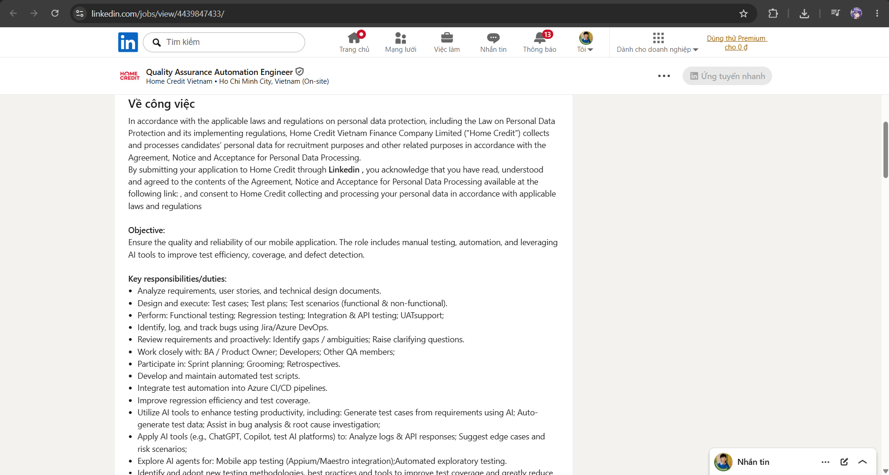

### 1.8. Vị trí 07 — Corsair

- **Liên kết:** https://www.linkedin.com/jobs/view/4444742177/
- **Thông tin cơ bản:** Software QA Engineer; Thành phố Hồ Chí Minh; toàn thời gian, cấp trung-cao; quan sát khoảng 1 tuần sau đăng; yêu cầu liên quan AI: **Không nêu trực tiếp**.
- **Lương/phúc lợi:** Không công bố trong tin LinkedIn.
- **Mô tả:** Thiết kế và thực thi kế hoạch/ca kiểm thử cho ứng dụng máy tính và web; bao gồm kiểm thử chức năng, hồi quy, tích hợp, khám phá, đa nền tảng và tự động.
- **Kỹ năng:** 3+ năm QA, Selenium/Playwright/Cypress/Qt Squish, JavaScript/TypeScript/Python, REST API, Git, Jira và Agile.
- **Mô tả công việc chi tiết:**

> **Role focus**
>
> Generalist software QA across desktop and web applications, combining manual testing, automation, API testing, desktop installer/update scenarios, Agile collaboration, and CI/CD integration.
>
> **Core responsibilities**
>
> - Design and execute test plans, test cases, and test scripts.
> - Perform functional, regression, integration, and exploratory testing.
> - Collaborate early with developers, product managers, and designers.
> - Develop/maintain automated tests using modern frameworks.
> - Track defects in Jira and verify fixes.
> - Participate in sprint planning, stand-ups, and retrospectives.
> - Integrate automated tests into CI/CD.
> - Improve QA processes continuously.
>
> **Requirements**
>
> - 3+ years software QA for desktop and web applications.
> - Strong QA fundamentals, test planning, test-case design, and defect management.
> - Manual functional/regression/exploratory testing.
> - Automation exposure with Selenium, Playwright, Cypress, Qt Squish, or similar.
> - JavaScript, TypeScript, or Python useful for scripting.
> - Cross-browser and responsive-design testing.
> - Windows/macOS installer, update, and configuration testing.
> - REST API testing via Postman or automated scripts.
> - Git, Jira, Agile.
> - Strong problem solving, detail orientation, and communication.

- **Phân tích tác động của AI:** AI có thể hỗ trợ tạo khung kiểm thử, dữ liệu kiểm thử và phân tích nhật ký; kiểm thử khám phá, đánh giá khả năng sử dụng và diễn giải lỗi vẫn cần con người.

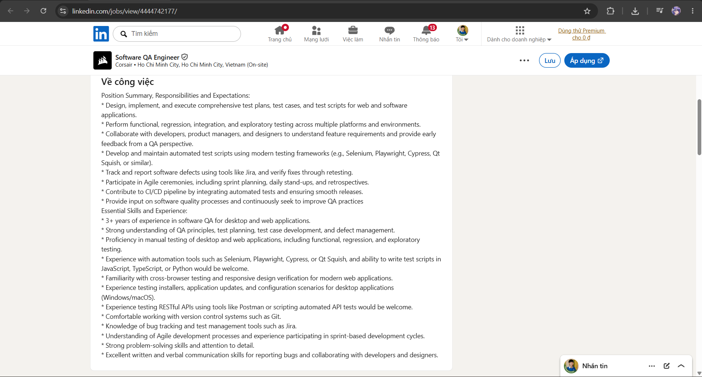

### 1.9. Vị trí 08 — Razer

- **Liên kết:** https://www.linkedin.com/jobs/view/4455257101/
- **Thông tin cơ bản:** QC Engineer; Thành phố Hồ Chí Minh; toàn thời gian; quan sát khoảng 1 ngày sau đăng; yêu cầu liên quan AI: **Không nêu trực tiếp**.
- **Lương/phúc lợi:** Không công bố trong tin LinkedIn.
- **Mô tả:** Làm rõ yêu cầu chức năng/phi chức năng, xây dựng chiến lược và ca kiểm thử, thực hiện kiểm thử thủ công/tự động, quản lý lỗi và cải thiện hạ tầng kiểm thử.
- **Kỹ năng:** API/Web Services/cơ sở dữ liệu, Postman, JMeter, Selenium, Playwright, kiểm thử hiệu năng/bảo mật, thiết kế khung kiểm thử và Agile.
- **Mô tả công việc chi tiết — giữ nguyên văn posting được cung cấp:**

> Joining Razer will place you on a global mission to revolutionize the way the world games. Razer is a place to do great work, offering you the opportunity to make an impact globally while working across a global team located across 5 continents. Razer is also a great place to work, providing you the unique, gamer-centric experience that will put you in an accelerated growth, both personally and professionally.
>
> As a QC Engineer, you will be part of a cross-functional team responsible for the entire software development lifecycle, from concept to deployment. You will be responsible for ensuring that our products and services are of the highest quality when we deliver them to our customers.
>
> **Responsibilities**
>
> - Requirement clarification: understand both the functional and non-functional requirements of the software by collaborating with stakeholders to ensure all aspects are well-defined, documented, and aligned with project goals.
> - Develop Test Strategy & Test Case: create and apply testing strategies by designing detailed test cases that address all functional and performance aspects of the software.
> - Executing Tests: execute test cases to assess the functionality, performance, and security of the product. This can include both manual and automated testing, based on the product's technical and functional requirements.
> - Defects Management: identifying, tracking, and resolving defects in a software. It includes prioritizing defects, assigning them for fixes, re-testing after fixes, and closing resolved issues.
> - Improvement: continuously improve the testing infrastructure to enhance its reliability and scalability.
> - Collaboration: coordinate with developers and other stakeholders to address issues and improve product performance and quality improvement.
>
> **Pre-Requisites**
>
> **Preferred Skills and Qualifications:**
>
> - Bachelor’s degree in Computer Science, Engineering, or related field.
> - At least 2 years of experience as a QC engineer.
> - Experience in testing APIs, Web Services, and Database.
> - Experience with testing tool: Postman, JMeter.
> - Experience in doing automation tests for API, and UI by using automation libraries such as Selenium, Playwright
> - Expertise in various types of testing, including penetration testing, functional testing, automation testing, and performance testing.
> - Strong analysis and design skills, capable to develop testing framework and integrate solutions.
> - Have experience working testing methods, with white box, black box, etc.
> - Strong knowledge and ability in using and setting up test environments
> - Based in Ho Chi Minh city
>
> **Plus**
>
> - ISTQB or equivalent testing certificate.
> - Working experience in game publishing industry.
>
> Razer is proud to be an Equal Opportunity Employer. We believe that diverse teams drive better ideas, better products, and a stronger culture. We are committed to providing an inclusive, respectful, and fair workplace for every employee across all the countries we operate in. We do not discriminate on the basis of race, ethnicity, colour, nationality, ancestry, religion, age, sex, sexual orientation, gender identity or expression, disability, marital status, or any other characteristic protected under local laws. Where needed, we provide reasonable accommodations - including for disability or religious practices - to ensure every team member can perform and contribute at their best.

- **Phân tích tác động của AI:** AI có thể tăng tốc phân tích yêu cầu và viết mã tự động hóa, nhưng quyết định mức độ nghiêm trọng, đánh giá rủi ro sản phẩm và phối hợp các bên liên quan vẫn là trách nhiệm của QC Engineer.

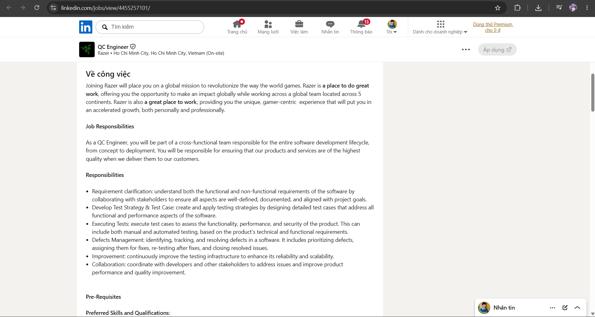

### 1.10. Vị trí 09 — CMC Global

- **Liên kết:** https://vn.linkedin.com/jobs/view/qa-qc-engineer-at-cmc-global-company-limited-4468071637
- **Thông tin cơ bản:** QA/QC Engineer; Thành phố Hồ Chí Minh; toàn thời gian; quan sát khoảng 13 phút sau đăng; yêu cầu liên quan AI: **Không nêu trực tiếp**.
- **Lương/phúc lợi:** Không công bố lương cơ bản; tổng thu nhập có thể tới 14 tháng lương/năm, kèm thưởng dự án và gói phúc lợi hằng năm.
- **Mô tả:** Tin tuyển dụng gồm nhiều vị trí QA tự động, QA thủ công/tự động và kiểm thử viên tự động; công việc bao gồm phân tích yêu cầu, xây dựng kịch bản/dữ liệu kiểm thử, kiểm thử chức năng/hồi quy/tích hợp/API và theo dõi lỗi.
- **Kỹ năng:** 2–3+ năm kiểm thử, Playwright/Selenium, API, SQL, thiết kế kiểm thử, tự động hóa và tiếng Anh; một số vị trí yêu cầu hiểu biết nghiệp vụ ngân hàng.
- **Mô tả công việc chi tiết:**

> **Open profiles**
>
> **1) Automation QA — District 2/3, onsite**
>
> - 2+ years.
> - Playwright and/or Selenium.
> - Banking-project experience required.
> - Requirement analysis, test scenarios/data, automated scripts, functional/regression/integration testing, defect lifecycle.
> - Non-English project environment.
>
> **2) QA Engineer — District 2, hybrid**
>
> - 2+ years.
> - Either 50% Manual / 50% Automation or 100% Automation.
> - Selenium/Playwright preferred.
> - Good English.
> - Functional, regression, integration, system testing; Agile/Scrum participation.
>
> **3) QA Engineer — Tân Bình, onsite**
>
> - 3+ years.
> - Either 80% Manual / 20% Automation or 100% Automation.
> - API testing and strong SQL/database testing.
> - Good English.
> - Functional, regression, integration, API, database validation, release support.
>
> **4) Automation Tester — Tân Bình, onsite**
>
> - 2+ years.
> - Selenium and/or Playwright.
> - Automated functional/regression suites, failure investigation, defect tracking, automation-coverage improvement.
> - Good English.
>
> **Benefits highlighted**
>
> Up to 14 months’ salary/year plus possible project bonus; extra annual benefits package; salary review twice/year; training/career development; international projects and onsite opportunities; premium healthcare and company activities.

- **Phân tích tác động của AI:** AI có thể hỗ trợ sinh mã lệnh và phân tích kết quả, nhưng nhà tuyển dụng vẫn yêu cầu nền tảng tự động hóa, API/SQL và kiến thức nghiệp vụ.

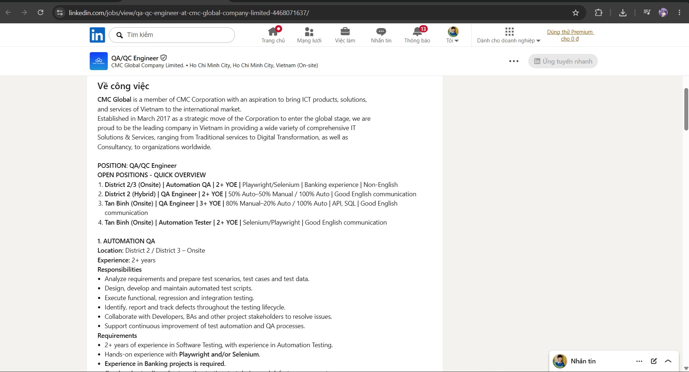

### 1.11. Vị trí 10 — Aperia

- **Liên kết:** https://www.linkedin.com/jobs/view/4444932511/
- **Thông tin cơ bản:** (Senior/Middle) QA Engineer; Thành phố Hồ Chí Minh; toàn thời gian, kết hợp tại văn phòng và từ xa; quan sát khoảng 1 tuần sau đăng; yêu cầu liên quan AI: **Không nêu trực tiếp**.
- **Lương/phúc lợi:** Không công bố con số; tin mô tả gói lương cạnh tranh.
- **Mô tả:** Tự động hóa QA và kiểm thử khám phá cho fintech/SaaS; dùng Playwright/Selenium, JMeter, Azure DevOps, CI/CD và kiểm thử microservices/API.
- **Kỹ năng:** 3+ năm kiểm thử tự động/khám phá, Playwright/TypeScript, Selenium, JMeter, Azure DevOps, hệ thống phân tán và tiếng Anh.
- **Mô tả công việc chi tiết:**

> **Core responsibilities**
>
> - Build and maintain automated tests using Playwright, Selenium, and related tools.
> - Conduct exploratory testing and document defects.
> - Perform performance testing with JMeter.
> - Test both On-Prem and cloud environments.
> - Use Azure DevOps for test cases, plans, and CI/CD.
> - Collaborate within Agile teams.
> - Produce detailed documentation and data-driven test reports.
> - Test microservices, micro frontends, and APIs with broad coverage.
>
> **Required technical skills**
>
> - 3+ years QA automation and exploratory testing.
> - Playwright/TypeScript, Selenium, JMeter, and related testing tools.
> - Performance-testing experience and ability to interpret performance metrics.
> - Agile experience.
> - Azure DevOps and CI/CD.
> - Strong understanding of microservices, micro frontends, and API testing.
> - Strong documentation/reporting, analytical thinking, and communication.
> - Strong written and verbal English.
>
> **Differentiators**
>
> Fintech experience · additional automation frameworks/tools · QA-related certifications.
>
> **Education / work details**
>
> Bachelor’s degree in Computer Science, IT, or related field. Monday–Friday schedule. Hybrid office listed at The Six8 Building, Tân Bình, Ho Chi Minh City.

- **Phân tích tác động của AI:** AI có thể hỗ trợ viết mã và tài liệu, nhưng hành vi hiệu năng, kiến trúc và kiểu lỗi trong môi trường vận hành vẫn đòi hỏi kỹ năng kỹ thuật thực chất.

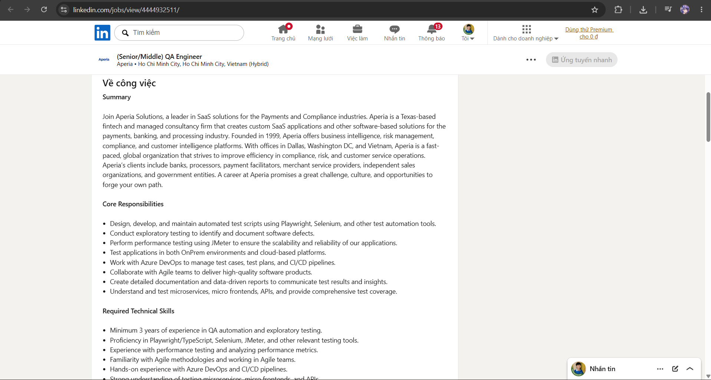

### 1.12. Tổng hợp thị trường và CLO G9.1

Các tin tuyển dụng cho thấy bốn xu hướng: nền tảng kiểm thử vẫn giữ vai trò cốt lõi; tự động hóa và CI/CD trở thành yêu cầu cơ bản; QA tham gia sớm hơn vào vòng đời phát triển; AI tạo ra cả hai hướng **AI hỗ trợ kiểm thử** và **kiểm thử hệ thống AI**. Sơ đồ tư duy ban đầu, ba lỗi được phát hiện và phiên bản đã sửa nằm trong [`QAQC_Role_Mindmap.md`](QAQC_Role_Mindmap.md).

| Nhóm năng lực | Bằng chứng lặp lại trong 10 tin | Ý nghĩa đối với sinh viên QA/QC |
|---|---|---|
| Nền tảng kiểm thử | Phân tích yêu cầu, thiết kế kiểm thử, kiểm thử khám phá, hồi quy, quản lý lỗi | Đây vẫn là nền tảng để phát hiện tiêu chuẩn đánh giá sai và đánh giá rủi ro; AI không thay thế được hiểu biết sản phẩm. |
| Kỹ thuật tự động hóa | Playwright/Selenium/Appium, API, SQL, Git, CI/CD | Tự động hóa không còn là kỹ năng phụ; người kiểm thử cần đọc mã, thiết kế kiểm thử dễ bảo trì và phân tích kết quả dương tính giả. |
| Trách nhiệm sở hữu chất lượng | Xác minh phát hành, đánh giá rủi ro, giám sát, quyết định phát hành/không phát hành | Vai trò QA dịch chuyển từ “người chạy kiểm thử cuối kỳ” sang người tham gia quyết định chất lượng xuyên vòng đời. |
| AI hỗ trợ kiểm thử | Sinh ý tưởng/dữ liệu kiểm thử, hỗ trợ viết mã, phân tích nhật ký/lỗi thực thi | Tăng tốc công việc lặp lại nhưng đầu ra phải được rà soát, đo độ bao phủ và kiểm tra bằng thực thi thực tế. |
| Kiểm thử hệ thống AI | Nội dung bịa đặt, prompt injection, nguồn gốc dữ liệu, sự trôi mô hình, tuân thủ | Người kiểm thử cần tiêu chuẩn đánh giá linh hoạt, tập dữ liệu đại diện, kiểm thử bảo mật/quyền riêng tư và giám sát của con người thay vì chỉ dùng kết quả mong đợi cố định. |

Từ góc nhìn nghề nghiệp, AI không làm biến mất QA/QC mà nâng chuẩn của vai trò: người kiểm thử phải hiểu cả chất lượng sản phẩm, tự động hóa, dữ liệu và giới hạn của mô hình. Sơ đồ tư duy cuối vì vậy không đặt AI làm trung tâm của nghề mà xem AI là một nhánh bổ sung dưới sự giám sát của con người.

---

## 2. 20 lỗi phần mềm giai đoạn 2022–2026 (20 điểm)

### 2.1. Bảng tổng hợp lỗi

| # | Sự cố / Tên lỗi | Năm | Phân loại | Mức độ nghiêm trọng | Nguồn chính |
|:---:|---|:---:|:---:|:---:|---|
| **1** | Slack AI Indirect Prompt Injection / Data-Exfiltration Scenario | 2024 | **AI / LLM** | Trung bình* | [Slack Security Update](https://slack.com/blog/news/slack-security-update-082124) |
| **2** | Ollama “Probllama” Path Traversal → RCE (CVE-2024-37032) | 2024 | **Hạ tầng AI** | Cao — CVSS 8.8 | [Wiz Research](https://www.wiz.io/blog/probllama-ollama-vulnerability-cve-2024-37032) |
| **3** | GitLab Duo Private-Issue Exfiltration via Prompt Injection (CVE-2024-3303) | 2025 | **AI / LLM** | Trung bình — CVSS 6.4 | [GitLab Security Release](https://about.gitlab.com/releases/2025/02/12/patch-release-gitlab-17-8-2-released/) |
| **4** | Langflow Unauthenticated Code Injection / RCE (CVE-2025-3248) | 2025 | **Hạ tầng AI** | Nghiêm trọng | [Langflow GitHub Advisory](https://github.com/langflow-ai/langflow/security/advisories/GHSA-rvqx-wpfh-mfx7) |
| **5** | Microsoft 365 Copilot “EchoLeak” AI Command Injection (CVE-2025-32711) | 2025 | **AI / LLM** | Nghiêm trọng — CVSS 9.3 | [Microsoft CVE Record](https://msrc.microsoft.com/update-guide/vulnerability/CVE-2025-32711) |
| **6** | FortiOS Administrative Authentication Bypass (CVE-2022-40684) | 2022 | Authentication / Access Control | Critical — CVSS 9.6 | [Fortinet PSIRT FG-IR-22-377](https://www.fortiguard.com/psirt/FG-IR-22-377) |
| **7** | Microsoft Exchange “ProxyNotShell” Chain (CVE-2022-41040 / CVE-2022-41082) | 2022 | SSRF / RCE | High | [Microsoft Security Blog](https://www.microsoft.com/en-us/security/blog/2022/09/30/analyzing-attacks-using-the-exchange-vulnerabilities-cve-2022-41040-and-cve-2022-41082/) |
| **8** | Debian Redis Lua Sandbox Escape (CVE-2022-0543) | 2022 | Sandbox Escape / RCE | High | [Debian DSA-5081-1](https://lists.debian.org/debian-security-announce/2022/msg00048.html) |
| **9** | Windows MSDT “Follina” (CVE-2022-30190) | 2022 | Code Execution | High | [Microsoft MSRC Guidance](https://www.microsoft.com/en-us/msrc/blog/2022/05/guidance-for-cve-2022-30190-microsoft-support-diagnostic-tool-vulnerability) |
| **10** | GitLab Password-Reset Account Takeover (CVE-2023-7028) | 2024 | Authentication / Account Recovery | Critical — CVSS 10.0 | [GitLab Critical Security Release](https://docs.gitlab.com/releases/patches/patch-release-gitlab-16-7-2-released/) |
| **11** | ownCloud GraphAPI Sensitive-Credential Disclosure (CVE-2023-49103) | 2023 | Information Disclosure | Critical — CVSS 10.0 | [ownCloud Security Advisory](https://owncloud.com/security-advisories/disclosure-of-sensitive-credentials-and-configuration-in-containerized-deployments/) |
| **12** | Confluence Template Injection → Unauthenticated RCE (CVE-2023-22527) | 2024 | Template Injection / RCE | Critical | [Atlassian Advisory](https://confluence.atlassian.com/security/cve-2023-22527-rce-remote-code-execution-vulnerability-in-confluence-data-center-and-server-1333990257.html) |
| **13** | Jenkins CLI Arbitrary File Read → Possible RCE (CVE-2024-23897) | 2024 | Arbitrary File Read | Critical | [Jenkins Security Advisory](https://www.jenkins.io/security/advisory/2024-01-24/) |
| **14** | PAN-OS GlobalProtect Command Injection (CVE-2024-3400) | 2024 | Command Injection / RCE | Critical — CVSS 10.0 | [Palo Alto Networks Advisory](https://security.paloaltonetworks.com/CVE-2024-3400) |
| **15** | ScreenConnect Authentication Bypass (CVE-2024-1709) | 2024 | Authentication Bypass | Critical — CVSS 10.0 | [ConnectWise Security Bulletin](https://www.connectwise.com/company/trust/security-bulletins/connectwise-screenconnect-23.9.8) |
| **16** | TeamCity On-Premises Authentication Bypass (CVE-2024-27198) | 2024 | Authentication Bypass | Critical | [JetBrains Security Notice](https://blog.jetbrains.com/teamcity/2024/03/additional-critical-security-issues-affecting-teamcity-on-premises-cve-2024-27198-and-cve-2024-27199-update-to-2023-11-4-now/) |
| **17** | OpenSSH “regreSSHion” Signal-Handler Race (CVE-2024-6387) | 2024 | Race Condition / RCE | High | [Qualys Research](https://www.qualys.com/regresshion-cve-2024-6387) |
| **18** | Cloudflare Bot Management Feature-File Outage | 2025 | Operational / Configuration Failure | Critical impact* | [Cloudflare Post-Mortem](https://blog.cloudflare.com/18-november-2025-outage/) |
| **19** | SharePoint “ToolShell” RCE (CVE-2025-53770) | 2025 | Deserialization / RCE | Critical — CVSS 9.8 | [Microsoft MSRC Guidance](https://www.microsoft.com/en-us/msrc/blog/2025/07/customer-guidance-for-sharepoint-vulnerability-cve-2025-53770) |
| **20** | FortiCloud SSO Cross-Account Authentication Bypass (CVE-2026-24858) | 2026 | Authentication / Access Control | Critical — CVSS 9.4 | [Fortinet PSIRT FG-IR-26-060](https://fortiguard.fortinet.com/psirt/FG-IR-26-060) |

* **Tổng số lỗi được ghi nhận:** 20 lỗi/sự cố được công bố trong giai đoạn 2022–2026.
* **Lỗi liên quan AI/LLM:** 5/20 — các mục **#1–#5**, đáp ứng yêu cầu tối thiểu `≥ 5`.
* **Kỷ luật nguồn:** 20/20 mục sử dụng nguồn gốc từ nhà cung cấp, dự án, CNA, báo cáo hậu kiểm hoặc đơn vị nghiên cứu trực tiếp.
* **Lưu ý về mức độ:** `Trung bình*` của Slack AI và `Tác động nghiêm trọng*` của sự cố Cloudflare là **đánh giá của báo cáo**, không phải điểm CVSS của nhà cung cấp. Mục #18 là lỗi vận hành/cấu hình phần mềm, không phải lỗ hổng CVE.

---

### 2.2. Phân tích chi tiết lỗi

#### 1. Slack AI Indirect Prompt Injection / Data-Exfiltration Scenario
- **Phân loại:** AI/LLM — indirect prompt injection, rủi ro phishing và rò rỉ dữ liệu.
- **Nguồn:** [Slack — Security Update, 21/08/2024](https://slack.com/blog/news/slack-security-update-082124).
- **Ngày công bố:** Slack đăng bản cập nhật bảo mật ngày **21/08/2024** và cho biết bản vá đã được triển khai ngày **20/08/2024**.
- **Mô tả và nguyên nhân kỹ thuật:** Slack xác nhận một kịch bản trong đó tác nhân độc hại đã có tài khoản trong **cùng workspace** có thể lợi dụng luồng tương tác Slack AI để lừa người dùng cung cấp dữ liệu. Thông báo không công bố nguyên nhân ở mức triển khai, vì vậy báo cáo không suy diễn thêm. Cách giải thích có cơ sở là nội dung không đáng tin cậy trong workspace có thể chi phối hành vi sinh của AI và vượt qua ranh giới ý định/tin cậy của người dùng. **Trích dẫn nguyên văn từ nguồn:** “under very limited and specific circumstances”.
- **Mức độ nghiêm trọng:** **Medium — đánh giá của báo cáo.** Slack không công bố CVSS; yêu cầu kẻ tấn công có tài khoản cùng workspace làm giảm khả năng khai thác so với lỗi không cần xác thực, nhưng tác động bảo mật dữ liệu vẫn đáng kể.
- **Hậu quả:** Người dùng có thể nhận output AI bị nội dung độc hại chi phối và bị dụ tiết lộ thông tin. Slack cho biết tại thời điểm công bố chưa có bằng chứng truy cập trái phép dữ liệu khách hàng.
- **Giải pháp/giảm thiểu:** Sử dụng bản vá đã được Slack triển khai; tách chỉ thị khỏi dữ liệu truy xuất, kiểm soát quyền ở bước retrieval, kiểm tra provenance, render liên kết an toàn và yêu cầu xác nhận của người dùng trước hành động nhạy cảm.

#### 2. Ollama “Probllama” Path Traversal → RCE (CVE-2024-37032)
- **Phân loại:** Hạ tầng AI — path traversal, ghi đè tệp tùy ý và khả năng RCE.
- **Nguồn:** [Wiz Research — Probllama](https://www.wiz.io/blog/probllama-ollama-vulnerability-cve-2024-37032) · [Wiz Vulnerability Database](https://www.wiz.io/vulnerability-database/cve/cve-2024-37032).
- **Ngày công bố:** Wiz công bố nghiên cứu ngày **24/06/2024**; các phiên bản **Ollama < 0.1.34** bị ảnh hưởng.
- **Mô tả và nguyên nhân kỹ thuật:** Ollama kiểm tra chưa đầy đủ định dạng digest/đường dẫn model khi xử lý model pull. Manifest độc hại có thể lợi dụng path traversal trong trường digest để ghi đè tệp tùy ý. API mặc định trên Linux chỉ bind localhost, nhưng việc expose API và quyền cao trong một số triển khai Docker làm tăng đáng kể mức độ rủi ro. **Trích dẫn nguyên văn từ nguồn:** “an easy-to-exploit Remote Code Execution vulnerability in Ollama”.
- **Mức độ nghiêm trọng:** **High — CVSS 8.8** theo Wiz. Kết luận này sửa cách gán “Critical” cho chính CVE trong bản nháp trước.
- **Hậu quả:** Có thể chiếm quyền inference server tự host, sửa/đánh cắp model và xâm phạm ứng dụng AI; ghi đè tệp có thể dẫn đến thực thi mã tùy bối cảnh.
- **Giải pháp/giảm thiểu:** Nâng cấp **Ollama 0.1.34+**; không expose API không xác thực trực tiếp ra Internet; đặt sau reverse proxy/middleware có xác thực, giới hạn mạng và kiểm tra chặt manifest/digest.

#### 3. GitLab Duo Private-Issue Exfiltration via Prompt Injection (CVE-2024-3303)
- **Phân loại:** AI/LLM — prompt injection làm hỏng ranh giới bảo mật thông tin.
- **Nguồn:** [GitLab Patch Release 17.8.2 / 17.7.4 / 17.6.5](https://about.gitlab.com/releases/2025/02/12/patch-release-gitlab-17-8-2-released/).
- **Ngày công bố:** Bản phát hành bảo mật ngày **12/02/2025**; các bản GitLab EE từ 16.0 đến các nhánh được vá bị ảnh hưởng.
- **Mô tả và nguyên nhân kỹ thuật:** Nội dung issue do kẻ tấn công kiểm soát có thể thao túng workflow AI và làm lộ nội dung của private issue. Defect cốt lõi là dữ liệu không đáng tin đã ảnh hưởng hoạt động AI vượt qua ranh giới confidentiality. **Trích dẫn nguyên văn từ nguồn:** “allows an attacker to exfiltrate contents of a private issue using prompt injection.”
- **Mức độ nghiêm trọng:** **Medium — CVSS 6.4** (`AV:N/AC:H/PR:L/UI:R/S:U/C:H/I:H/A:N`) theo GitLab.
- **Hậu quả:** Dữ liệu dự án riêng tư có thể bị lộ; quyền truy cập ở lớp ứng dụng không được bảo toàn khi AI truy xuất, tóm tắt hoặc biến đổi context được bảo vệ.
- **Giải pháp/giảm thiểu:** Nâng cấp lên **17.6.5, 17.7.4, 17.8.2** hoặc bản vá được hỗ trợ mới hơn; kiểm tra quyền ở mọi ranh giới retrieval/action, coi nội dung issue là dữ liệu và áp dụng context scoping/output filtering.

#### 4. Langflow Unauthenticated Code Injection / RCE (CVE-2025-3248)
- **Phân loại:** Hạ tầng AI — code injection/RCE không cần xác thực.
- **Nguồn:** [Langflow GitHub Security Advisory GHSA-rvqx-wpfh-mfx7](https://github.com/langflow-ai/langflow/security/advisories/GHSA-rvqx-wpfh-mfx7).
- **Ngày công bố:** Advisory ngày **17/06/2025**; ảnh hưởng phiên bản **< 1.3.0**, được vá từ **1.3.0**.
- **Mô tả và nguyên nhân kỹ thuật:** Endpoint `/api/v1/validate/code` xử lý input được chế tạo theo cách cho phép code injection. Do không yêu cầu xác thực, máy chủ bị expose có thể bị ép thực thi mã từ xa. **Trích dẫn nguyên văn từ nguồn:** “A remote and unauthenticated attacker can send crafted HTTP requests to execute arbitrary code.”
- **Mức độ nghiêm trọng:** **Critical** theo advisory của dự án.
- **Hậu quả:** Có thể chiếm host, đánh cắp secret, sửa flow/model/data và di chuyển ngang với quyền của tiến trình/container Langflow.
- **Giải pháp/giảm thiểu:** Nâng cấp **Langflow 1.3.0+**; hạn chế expose API quản trị, bắt buộc authentication/authorization và cô lập khả năng đánh giá mã bằng least privilege cùng sandbox.

#### 5. Microsoft 365 Copilot “EchoLeak” AI Command Injection (CVE-2025-32711)
- **Phân loại:** AI/LLM — indirect/AI command injection và information disclosure.
- **Nguồn:** [Microsoft Security Update Guide — CVE-2025-32711](https://msrc.microsoft.com/update-guide/vulnerability/CVE-2025-32711) · [CVE record](https://www.cve.org/CVERecord?id=CVE-2025-32711).
- **Ngày công bố:** Bản ghi CNA của Microsoft được công bố ngày **11/06/2025** cho **Microsoft 365 Copilot**.
- **Mô tả và nguyên nhân kỹ thuật:** Nội dung không đáng tin đưa vào Copilot có thể khiến model làm theo chỉ thị do kẻ tấn công chi phối và làm lộ context được bảo vệ mà không theo luồng disclosure thông thường của người dùng. **Trích dẫn nguyên văn từ nguồn:** “Ai command injection in M365 Copilot allows an unauthorized attacker to disclose information over a network.”
- **Mức độ nghiêm trọng:** **Critical — CVSS 9.3** (`AV:N/AC:L/PR:N/UI:N/S:C/C:H/I:L/A:N`) theo Microsoft.
- **Hậu quả:** Thông tin Microsoft 365 mà Copilot truy cập được có thể bị tiết lộ qua ranh giới security scope; vector không yêu cầu user interaction làm tăng rủi ro.
- **Giải pháp/giảm thiểu:** Áp dụng remediation phía dịch vụ của Microsoft; cô lập nội dung truy xuất không đáng tin khỏi chỉ thị đặc quyền, giới hạn outbound channel, kiểm tra lại quyền tại thời điểm hành động và yêu cầu xác nhận rõ ràng trước khi xuất dữ liệu nhạy cảm.

#### 6. FortiOS Administrative Authentication Bypass (CVE-2022-40684)
- **Phân loại:** Authentication/access control — bypass xác thực trên giao diện quản trị.
- **Nguồn:** [Fortinet PSIRT FG-IR-22-377](https://www.fortiguard.com/psirt/FG-IR-22-377).
- **Ngày công bố:** Fortinet công bố advisory ngày **10/10/2022**; thành phần GUI, kiểu tấn công không cần xác thực.
- **Mô tả và nguyên nhân kỹ thuật:** Lỗi authentication bypass qua alternate path/channel cho phép kẻ tấn công từ xa gửi request được chế tạo đặc biệt để thao tác trên giao diện quản trị.
- **Mức độ nghiêm trọng:** **Critical — CVSS 9.6** theo Fortinet.
- **Hậu quả:** Thay đổi quản trị trái phép có thể phá vỡ confidentiality, integrity và availability của thiết bị biên; tài khoản/cấu hình do kẻ tấn công tạo có thể duy trì persistence.
- **Giải pháp/giảm thiểu:** Nâng cấp theo các bản cố định trong PSIRT, giới hạn management interface vào mạng tin cậy và rà soát mọi thay đổi cấu hình/tài khoản sau thời gian expose.

#### 7. Microsoft Exchange “ProxyNotShell” Chain (CVE-2022-41040 / CVE-2022-41082)
- **Phân loại:** SSRF và remote code execution.
- **Nguồn:** [Microsoft Security — analysis of attacks](https://www.microsoft.com/en-us/security/blog/2022/09/30/analyzing-attacks-using-the-exchange-vulnerabilities-cve-2022-41040-and-cve-2022-41082/).
- **Ngày công bố:** Microsoft công bố phân tích ngày **30/09/2022** và phát hành bản vá ngày **08/11/2022**.
- **Mô tả và nguyên nhân kỹ thuật:** CVE-2022-41040 là SSRF; CVE-2022-41082 cho phép RCE khi Exchange PowerShell có thể truy cập. Chuỗi khai thác mô tả yêu cầu kẻ tấn công đã xác thực. **Trích dẫn nguyên văn từ nguồn:** “CVE-2022-41040 is a server-side request forgery (SSRF) vulnerability”.
- **Mức độ nghiêm trọng:** **High.** Báo cáo không gán chung “Critical” vì nguồn nhấn mạnh điều kiện xác thực và đây là hai CVE riêng biệt.
- **Hậu quả:** Microsoft ghi nhận cài web shell, trinh sát Active Directory và exfiltrate dữ liệu từ Exchange Server bị xâm nhập.
- **Giải pháp/giảm thiểu:** Cài security update, sử dụng Exchange Emergency Mitigation Service khi phù hợp, hunt web shell/IOC và giảm expose PowerShell không cần thiết.

#### 8. Debian Redis Lua Sandbox Escape (CVE-2022-0543)
- **Phân loại:** Sandbox escape/code execution.
- **Nguồn:** [Debian Security Advisory DSA-5081-1](https://lists.debian.org/debian-security-announce/2022/msg00048.html).
- **Ngày công bố:** Advisory ngày **18/02/2022**.
- **Mô tả và nguyên nhân kỹ thuật:** Đây là lỗi Lua sandbox escape riêng cho gói Debian của Redis; môi trường build/package làm lộ capability lẽ ra không được truy cập từ sandbox. **Trích dẫn nguyên văn từ nguồn:** “Reginaldo Silva discovered a (Debian-specific) Lua sandbox escape in Redis”.
- **Mức độ nghiêm trọng:** **High — đánh giá của báo cáo** vì khai thác thành công có thể vượt sandbox và gọi chức năng hệ thống; advisory không công bố CVSS trong phần trích dẫn.
- **Hậu quả:** Redis expose ra mạng không tin cậy có thể trở thành đường thực thi mã với quyền service account và dẫn đến chiếm host rộng hơn.
- **Giải pháp/giảm thiểu:** Nâng cấp các gói Debian đã vá; không expose Redis ra mạng không tin cậy và áp dụng network/authentication control phù hợp.

#### 9. Windows MSDT “Follina” (CVE-2022-30190)
- **Phân loại:** Thực thi mã qua Microsoft Support Diagnostic Tool URL protocol.
- **Nguồn:** [Microsoft MSRC — Guidance for CVE-2022-30190](https://www.microsoft.com/en-us/msrc/blog/2022/05/guidance-for-cve-2022-30190-microsoft-support-diagnostic-tool-vulnerability).
- **Ngày công bố:** Microsoft phát hành hướng dẫn ngày **30/05/2022**.
- **Mô tả và nguyên nhân kỹ thuật:** Document/URL được chế tạo có thể gọi MSDT qua URL protocol và chạy mã với quyền của ứng dụng gọi. Nội dung tài liệu bên ngoài đã đi qua trust boundary để tới cơ chế chẩn đoán có capability quá lớn.
- **Mức độ nghiêm trọng:** **High**.
- **Hậu quả:** Thực thi mã cục bộ, đọc/sửa dữ liệu và thực hiện hành động tiếp theo với quyền của người dùng/ứng dụng hiện tại.
- **Giải pháp/giảm thiểu:** Cài security update của Microsoft; vô hiệu hóa MSDT URL protocol chỉ là workaround lịch sử, không thay thế bản vá.

#### 10. GitLab Password-Reset Account Takeover (CVE-2023-7028)
- **Phân loại:** Authentication/account recovery — cơ chế khôi phục mật khẩu yếu.
- **Nguồn:** [GitLab Critical Security Release](https://docs.gitlab.com/releases/patches/patch-release-gitlab-16-7-2-released/) · [GitLab CNA record](https://gitlab.com/gitlab-org/cves/-/blob/master/2023/CVE-2023-7028.json).
- **Ngày công bố:** GitLab phát hành bản vá ngày **11/01/2024**.
- **Mô tả và nguyên nhân kỹ thuật:** GitLab CE/EE có thể gửi email reset mật khẩu tới **địa chỉ email chưa xác minh**, cho phép chuyển luồng recovery khỏi mailbox hợp lệ. **Trích dẫn nguyên văn từ nguồn:** “user account password reset emails could be delivered to an unverified email address.”
- **Mức độ nghiêm trọng:** **Critical — CVSS 10.0** theo GitLab.
- **Hậu quả:** Có thể takeover tài khoản không bật 2FA mà không cần tương tác thông thường; 2FA giúp ngăn takeover hoàn toàn dù mật khẩu bị reset.
- **Giải pháp/giảm thiểu:** Nâng cấp lên nhánh đã vá hoặc bản hỗ trợ mới hơn, bật MFA và audit thay đổi email recovery/tài khoản.

#### 11. ownCloud GraphAPI Sensitive-Credential Disclosure (CVE-2023-49103)
- **Phân loại:** Information disclosure/credential exposure.
- **Nguồn:** [ownCloud Security Advisory](https://owncloud.com/security-advisories/disclosure-of-sensitive-credentials-and-configuration-in-containerized-deployments/).
- **Ngày công bố:** ownCloud công bố advisory ngày **21/11/2023**.
- **Mô tả và nguyên nhân kỹ thuật:** Ứng dụng `graphapi` chứa URL/tệp test của bên thứ ba expose `phpinfo()`, làm lộ cấu hình PHP/môi trường và secret nằm trong environment variable của deployment container. **Trích dẫn nguyên văn từ nguồn:** “it reveals the configuration details of the PHP environment (phpinfo).”
- **Mức độ nghiêm trọng:** **Critical — CVSS 10.0** theo ownCloud.
- **Hậu quả:** Có thể lộ mật khẩu admin, mail/database credential, khóa S3/object store, license key và dữ liệu môi trường khác. Chỉ disable app không đủ vì tệp lỗi vẫn tồn tại.
- **Giải pháp/giảm thiểu:** Xóa tệp `GetPhpInfo.php` theo advisory, tắt `phpinfo`, cập nhật/hardening deployment và rotate mọi secret có khả năng bị lộ.

#### 12. Confluence Template Injection → Unauthenticated RCE (CVE-2023-22527)
- **Phân loại:** Template injection/remote code execution.
- **Nguồn:** [Atlassian Security Advisory](https://confluence.atlassian.com/security/cve-2023-22527-rce-remote-code-execution-vulnerability-in-confluence-data-center-and-server-1333990257.html).
- **Ngày công bố:** Advisory ngày **16/01/2024**; mã CVE mang năm 2023 nhưng bằng chứng công bố nằm trong giai đoạn bài tập.
- **Mô tả và nguyên nhân kỹ thuật:** Template expression do kẻ tấn công kiểm soát có thể đi tới thực thi phía server trên các bản Confluence Data Center/Server lỗi thời. **Trích dẫn nguyên văn từ nguồn:** “allows an unauthenticated attacker to achieve RCE on an affected version.”
- **Mức độ nghiêm trọng:** **Critical** do RCE không cần xác thực trên collaboration server.
- **Hậu quả:** Chiếm server, lộ nội dung/credential Confluence, tạo persistence và pivot sang hệ thống nội bộ liên kết.
- **Giải pháp/giảm thiểu:** Nâng cấp ngay lên bản Confluence đã vá/được hỗ trợ; giảm exposure mạng không thay thế patching.

#### 13. Jenkins CLI Arbitrary File Read → Possible RCE (CVE-2024-23897)
- **Phân loại:** Đọc tệp tùy ý/lộ secret, có thể tạo chuỗi RCE.
- **Nguồn:** [Jenkins Security Advisory 2024-01-24](https://www.jenkins.io/security/advisory/2024-01-24/).
- **Ngày công bố:** Advisory ngày **24/01/2024**.
- **Mô tả và nguyên nhân kỹ thuật:** Jenkins CLI dùng parser `args4j` khi `expandAtFiles` đang bật; đối số bắt đầu bằng `@` và đường dẫn có thể được mở rộng thành nội dung tệp trên controller. **Trích dẫn nguyên văn từ nguồn:** “Arbitrary file read vulnerability through the CLI can lead to RCE”.
- **Mức độ nghiêm trọng:** **Critical** theo Jenkins.
- **Hậu quả:** Đọc secret/key trên controller và có thể nối tiếp thành thực thi mã hoặc compromise Jenkins rộng hơn.
- **Giải pháp/giảm thiểu:** Nâng cấp lên bản đã vá hoặc bản hỗ trợ mới hơn, hạn chế CLI và rotate secret nếu nghi ngờ expose.

#### 14. PAN-OS GlobalProtect Command Injection (CVE-2024-3400)
- **Phân loại:** Tạo tệp tùy ý dẫn đến OS command injection/root RCE.
- **Nguồn:** [Palo Alto Networks Security Advisory CVE-2024-3400](https://security.paloaltonetworks.com/CVE-2024-3400).
- **Ngày công bố:** Công bố **12/04/2024**, cập nhật **03/05/2024**.
- **Mô tả và nguyên nhân kỹ thuật:** Ở phiên bản/cấu hình PAN-OS bị ảnh hưởng, việc tạo tệp tùy ý trong GlobalProtect có thể chuyển thành OS command injection. **Trích dẫn nguyên văn từ nguồn:** “may enable an unauthenticated attacker to execute arbitrary code with root privileges on the firewall.”
- **Mức độ nghiêm trọng:** **Critical — CVSS 10.0**, urgency `HIGHEST`, không cần privilege hay user interaction.
- **Hậu quả:** Compromise firewall với quyền root, lộ cấu hình/credential, thay đổi policy và thiết lập persistence.
- **Giải pháp/giảm thiểu:** Nâng cấp PAN-OS/hotfix theo advisory; dùng threat-prevention signature và quy trình incident response nếu từng expose.

#### 15. ScreenConnect Authentication Bypass (CVE-2024-1709)
- **Phân loại:** Authentication bypass (CWE-288).
- **Nguồn:** [ConnectWise ScreenConnect 23.9.8 Security Fix](https://www.connectwise.com/company/trust/security-bulletins/connectwise-screenconnect-23.9.8).
- **Ngày công bố:** Bulletin ngày **19/02/2024**; ảnh hưởng on-premises **23.9.7 trở về trước**.
- **Mô tả và nguyên nhân kỹ thuật:** Alternate-path bypass cho phép người dùng ẩn danh chạm tới chức năng yêu cầu xác thực và tạo tài khoản đặc quyền. **Trích dẫn nguyên văn từ nguồn:** “a bad actor could mimic the role as system admin ... and take over the instance.”
- **Mức độ nghiêm trọng:** **Critical — CVSS 10.0**.
- **Hậu quả:** Takeover quản trị server, lạm dụng remote management trên endpoint liên kết, xóa người dùng và thực hiện post-exploitation.
- **Giải pháp/giảm thiểu:** Nâng cấp **23.9.8+** hoặc bản vá hiện hành, rà soát IOC/account/log và hardening trước khi đưa server expose trở lại dịch vụ.

#### 16. TeamCity On-Premises Authentication Bypass (CVE-2024-27198)
- **Phân loại:** Authentication bypass/administrative control.
- **Nguồn:** [JetBrains — Critical TeamCity On-Premises Issues](https://blog.jetbrains.com/teamcity/2024/03/additional-critical-security-issues-affecting-teamcity-on-premises-cve-2024-27198-and-cve-2024-27199-update-to-2023-11-4-now/).
- **Ngày công bố:** JetBrains công bố tháng **03/2024**.
- **Mô tả và nguyên nhân kỹ thuật:** HTTP request được tạo đặc biệt có thể bỏ qua kiểm tra xác thực; các bản TeamCity On-Premises đến **2023.11.3** bị ảnh hưởng. **Trích dẫn nguyên văn từ nguồn:** “bypass the authentication checks and gain administrative control”.
- **Mức độ nghiêm trọng:** **Critical** theo JetBrains.
- **Hậu quả:** Kẻ tấn công không xác thực có thể kiểm soát CI/CD server, source code, build config/artifact, signing/deployment credential và môi trường build.
- **Giải pháp/giảm thiểu:** Nâng cấp **2023.11.4+** hoặc cài security patch plugin; tạm ngắt public access nếu chưa vá và điều tra audit/log.

#### 17. OpenSSH “regreSSHion” Signal-Handler Race (CVE-2024-6387)
- **Phân loại:** Race condition/regression/remote code execution.
- **Nguồn:** [Qualys — regreSSHion CVE-2024-6387](https://www.qualys.com/regresshion-cve-2024-6387).
- **Ngày công bố:** Qualys công bố ngày **01/07/2024**; regression xuất hiện từ OpenSSH **8.5p1** và được sửa ở **9.8p1**.
- **Mô tả và nguyên nhân kỹ thuật:** Signal-handler race condition tái xuất hiện một lớp lỗi từng được sửa ở CVE-2006-5051; trên Linux dùng glibc, kết nối không xác thực được canh thời điểm chính xác có thể chạm vào signal-handler không an toàn. **Trích dẫn nguyên văn từ nguồn:** “an unauthenticated remote code execution in OpenSSH’s server (sshd) that grants full root access.”
- **Mức độ nghiêm trọng:** **High.** Tác động có thể là root RCE nhưng khai thác thực tế phụ thuộc timing và phức tạp.
- **Hậu quả:** Thực thi mã quyền root trên SSH server expose, compromise toàn bộ dữ liệu và dịch vụ của host.
- **Giải pháp/giảm thiểu:** Nâng cấp **OpenSSH 9.8p1+** hoặc gói vendor đã vá, hạn chế expose SSH và dùng network control trong thời gian patch.

#### 18. Cloudflare Bot Management Feature-File Outage
- **Phân loại:** Lỗi vận hành/cấu hình/validation, không phải CVE.
- **Nguồn:** [Cloudflare — Outage on November 18, 2025](https://blog.cloudflare.com/18-november-2025-outage/).
- **Ngày công bố:** Sự cố và post-mortem ngày **18/11/2025**; lỗi lớn bắt đầu 11:20 UTC và hệ thống trở lại bình thường lúc 17:06 UTC.
- **Mô tả và nguyên nhân kỹ thuật:** Thay đổi quyền database làm query trả dòng trùng, khiến feature file Bot Management tăng hơn gấp đôi. Runtime giới hạn **200 features** nên file vượt giới hạn làm module panic sau khi cấu hình xấu lan toàn cầu. **Trích dẫn nguyên văn từ nguồn:** “The issue was not caused, directly or indirectly, by a cyber attack”.
- **Mức độ nghiêm trọng:** **Critical về tác động vận hành — đánh giá của báo cáo, không phải CVSS.**
- **Hậu quả:** CDN/security traffic trả HTTP 5xx diện rộng; sản phẩm phụ thuộc cũng bị ảnh hưởng. Lỗi cho thấy thiếu kiểm tra compatibility/size invariant giữa generator và runtime.
- **Giải pháp/giảm thiểu:** Cloudflare dừng propagation, đưa file tốt đã biết vào và restart core proxy; phòng ngừa bằng schema/invariant validation, rollout theo giai đoạn, rollback tự động và test generator theo giới hạn runtime.

#### 19. SharePoint “ToolShell” RCE (CVE-2025-53770)
- **Phân loại:** Deserialization/remote code execution trên SharePoint on-premises.
- **Nguồn:** [Microsoft MSRC — Customer Guidance](https://www.microsoft.com/en-us/msrc/blog/2025/07/customer-guidance-for-sharepoint-vulnerability-cve-2025-53770) · [CVE Record](https://www.cve.org/CVERecord?id=CVE-2025-53770).
- **Ngày công bố:** Microsoft công bố hướng dẫn ngày **19/07/2025**.
- **Mô tả và nguyên nhân kỹ thuật:** Unsafe handling/deserialization trên SharePoint Server on-premises có thể dẫn đến RCE; SharePoint Online không thuộc phạm vi lỗi. **Trích dẫn nguyên văn từ nguồn:** “active attacks targeting on-premises SharePoint Server customers”.
- **Mức độ nghiêm trọng:** **Critical — CVSS 9.8**.
- **Hậu quả:** Cài web shell, compromise server và đánh cắp/sử dụng ASP.NET machine key để duy trì persistence ngay cả sau patch nếu key không được rotate.
- **Giải pháp/giảm thiểu:** Cài security update mới nhất, bật/cấu hình AMSI và endpoint protection, **rotate SharePoint ASP.NET machine key**, restart IIS và ngắt hoặc đặt sau truy cập xác thực nếu chưa thể bảo vệ.

#### 20. FortiCloud SSO Cross-Account Authentication Bypass (CVE-2026-24858)
- **Phân loại:** Authentication/cross-account access control (CWE-288).
- **Nguồn:** [Fortinet PSIRT FG-IR-26-060](https://fortiguard.fortinet.com/psirt/FG-IR-26-060).
- **Ngày công bố:** Fortinet công bố lần đầu ngày **27/01/2026** và xác nhận đã quan sát khai thác thực tế.
- **Mô tả và nguyên nhân kỹ thuật:** Khi bật FortiCloud SSO quản trị, kẻ tấn công có FortiCloud account và thiết bị đăng ký có thể vượt tenant/account boundary để xác thực vào thiết bị của tài khoản khác. **Trích dẫn nguyên văn từ nguồn:** “may allow an attacker with a FortiCloud account ... to log into other devices registered to other accounts”.
- **Mức độ nghiêm trọng:** **Critical — CVSS 9.4**; đã bị khai thác thực tế.
- **Hậu quả:** Tải configuration file của khách hàng và thêm administrator account để persistence trên các dòng sản phẩm Fortinet bị ảnh hưởng.
- **Giải pháp/giảm thiểu:** Nâng cấp theo phiên bản cố định trong FG-IR-26-060, rà soát tài khoản admin/log/IOC, rotate credential có khả năng lộ và tắt FortiCloud administrative SSO nếu không cần.

---

### 2.3. Kiểm toán hiện tượng bịa đặt và thiên lệch giải thích của AI (Sản phẩm #2)

#### 1. Bối cảnh và bản chất lỗi AI

Trong quá trình kiểm tra chéo Lỗi #2, báo cáo phát hiện một ví dụ có thể quan sát trực tiếp về **dữ liệu mô tả do AI bịa đặt/phân loại sai** trên trang Wiz Vulnerability Database cho `CVE-2024-37032`. Trang này tự ghi **“Source: This report was generated using AI”**, nhưng tiêu đề hiển thị **“NixOS vulnerability analysis and mitigation”** trong khi phần mô tả, gói bị ảnh hưởng và nghiên cứu gốc của Wiz đều xác định lỗ hổng cốt lõi là **Ollama / `github.com/ollama/ollama`**.

Điểm quan trọng: đây không phải lý do để bác bỏ toàn bộ nội dung trang. Phần thân của báo cáo do AI tạo mô tả đúng Ollama, phiên bản bị ảnh hưởng `< 0.1.34`, path traversal/RCE và CVSS 8.8. Lỗi nằm ở **nhãn thực thể/sản phẩm trong tiêu đề**, tức một mâu thuẫn dữ kiện ngay trong cùng một sản phẩm.

#### 2. Khẳng định sai của AI và dữ kiện đã xác minh

| Điểm kiểm toán | Đầu ra do AI tạo trong Wiz DB | Bằng chứng gốc/nghiên cứu đã xác minh | Kết luận |
|---|---|---|:---:|
| Sản phẩm được nêu trong tiêu đề trang | **“NixOS vulnerability analysis and mitigation”** | Wiz Research: **“an easy-to-exploit Remote Code Execution vulnerability in Ollama”**; gói bị ảnh hưởng được ghi là `github.com/ollama/ollama` | **INVALID** |
| Sản phẩm/phiên bản bị ảnh hưởng trong phần thân | Ollama trước 0.1.34 | Wiz Research khuyến nghị nâng cấp Ollama lên 0.1.34 hoặc mới hơn | **VALID** |
| Cơ chế kỹ thuật cốt lõi | Xác thực digest không đầy đủ → path traversal / ghi đè tệp tùy ý → RCE trong triển khai liên quan | Khớp với nghiên cứu kỹ thuật Probllama của Wiz | **VALID** |
| Dữ liệu mức độ nghiêm trọng | Điểm 8.8, `HIGH` | Wiz DB ghi điểm CNA 8.8 / HIGH | **VALID** |

#### 3. Ảnh hưởng đối với QA và quản lý lỗ hổng

Sai **danh tính sản phẩm** là lỗi dữ liệu mô tả có thể gây tác động vận hành lớn dù phần mô tả kỹ thuật bên dưới đúng. Nếu chuyên viên phân tích, công cụ quét tài sản hoặc quy trình tạo phiếu công việc lấy tiêu đề làm nguồn chính, lỗi có thể bị gán sai đơn vị phụ trách, quét sai danh mục tài sản hoặc tạo phiếu khắc phục cho hệ điều hành/gói không phải nguyên nhân gốc. Đây là ví dụ rõ ràng cho nguyên tắc kiểm thử rằng một đầu ra không được xem là “đúng” chỉ vì phần lớn nội dung nghe hợp lý; các trường quan trọng như sản phẩm, phiên bản, CVE, mức độ nghiêm trọng và phiên bản đã sửa phải được đối chiếu chéo độc lập.

#### 4. Hiệu chỉnh của sinh viên

Trong danh sách lỗi cuối, sản phẩm được sửa thành **Ollama**, mức độ nghiêm trọng được ghi **Cao — CVSS 8.8**, phiên bản bị ảnh hưởng là **Ollama < 0.1.34**, và biện pháp khắc phục là **nâng cấp lên 0.1.34+**. `NixOS` chỉ có thể xuất hiện như một hệ sinh thái bản phân phối/gói liên quan trong dữ liệu lỗ hổng ở hạ nguồn; nó không được trình bày như sản phẩm gốc của CVE này.

> **Liên kết kiểm toán AI:** Prompt/công cụ/mốc thời gian, đầu ra thô, lập luận kết luận và phần hiệu chỉnh được lưu trong [Báo cáo kiểm toán AI-02](%5BAI-02%5D%20-%20FIT@HCMUS%20-%20AI%20Audit%20Report.md). Phần 2.3 trình bày bằng chứng và hiệu chỉnh chính trong báo cáo.

---

## 3. Kiểm thử sản phẩm vật lý (thang điểm: 25 điểm)

### 3.1. Thông tin thiết bị và bằng chứng

| Trường | Giá trị |
|---|---|
| Loại thiết bị | Quạt bàn điện, cánh 29 cm |
| Hãng | SENKO |
| Model | |
| Tháng/năm sản xuất | 09-2025 |
| Số lô sản xuất | 109 |
| Serial number | |
| Điện áp/tần số định mức | 220 V / 50 Hz |
| Công suất | 40 W |
| Điều khiển | Nút cơ OFF/1/2/3 |
| Cơ cấu dao động | Núm/chốt cơ |

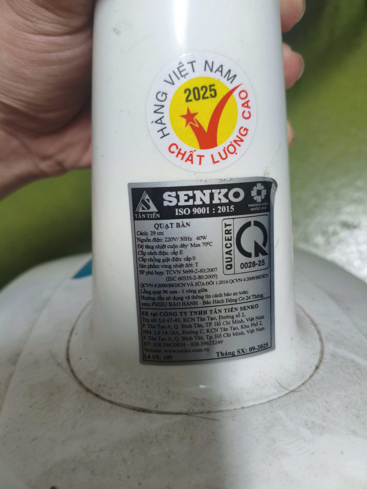

### 3.2. Phân tích bộ kiểm thử cơ sở do AI đề xuất và các trường hợp biên

Bộ kiểm thử cơ sở do AI đề xuất bao phủ mười luồng thuận: bật/tắt, ba mức tốc độ, dao động, điều chỉnh góc nghiêng, tay xách/thân quạt, độ ổn định, vận hành liên tục và khoảng hở giữa cánh với lồng quạt. Bộ cơ sở được đánh giá **INCOMPLETE** vì chưa xét thao tác chưa hoàn tất, thao tác gần đồng thời, khôi phục trạng thái sau khi cấp lại nguồn, biên cơ học phụ thuộc trạng thái và chuyển mức lặp lại. Năm ca kiểm thử TC-11–TC-15 được bổ sung để lấp các khoảng trống này mà không dùng thao tác phá huỷ.

### 3.3. Bộ 15 ca kiểm thử

| Mã kiểm thử | Mục tiêu | Dữ liệu vào / thao tác | Kết quả mong đợi | Kết quả thực tế | Kết luận |
|---|---|---|---|---|---|
| TC-01 | Xác minh quạt khởi động ở mức 1 từ OFF. | Nhấn mức 1, quan sát 10 giây. | Một mức tốc độ được gài; cánh tăng tốc bình thường, không cọ/rung/mùi khét/tia lửa. | Quạt khởi động ở mức 1; tốc độ ổn định; không ghi nhận cọ, rung, mùi khét hay tia lửa. | PASS |
| TC-02 | Xác minh chuyển mức 1 → 2 → 3. | Nhấn tuần tự ba mức tốc độ. | Mức cũ nhả, mức mới gài; luồng gió tăng theo mức; không có hai nút cùng bị gài. | Ba mức chuyển đúng thứ tự; luồng gió tăng; mỗi thời điểm chỉ một nút tốc độ được gài. | PASS |
| TC-03 | Xác minh OFF dừng quạt từ mức 3. | Chạy mức 3 rồi nhấn OFF/0. | Bộ truyền động dừng, cánh giảm tốc tự nhiên, không rung/ồn/kẹt nút bất thường. | Nút OFF ngắt bộ truyền động; cánh giảm tốc tự nhiên và dừng; không ghi nhận bất thường. | PASS |
| TC-04 | Bật dao động ngang khi đang chạy. | Chạy mức 2, gài núm/chốt dao động. | Đầu quạt dao động trơn tru, không trượt nhông, phát tiếng nghiến hay giật. | Đầu quạt bắt đầu dao động đều; không ghi nhận trượt nhông, tiếng nghiến hoặc giật. | PASS |
| TC-05 | Tắt dao động giữa hành trình. | Nhả núm/chốt khi đầu quạt ở giữa hành trình. | Dao động dừng, quạt tiếp tục thổi cố định, không kẹt hoặc phát tiếng bất thường. | Dao động dừng; cánh vẫn quay ở tốc độ đã chọn; không kẹt hoặc phát tiếng lạ. | PASS |
| TC-06 | Kiểm tra điều chỉnh góc nghiêng và khả năng giữ góc. | Chỉnh các vị trí nghiêng khi OFF, chạy mức 3 trong 30 giây. | Khớp giữ được góc, không tụt và không làm cánh chạm lồng quạt. | Khớp giữ vị trí trong 30 giây ở mức 3; không tụt góc hoặc chạm lồng quạt. | PASS |
| TC-07 | Kiểm tra tay xách và liên kết thân quạt. | Khi quạt OFF, quan sát và tác động lực nhẹ bằng tay. | Tay xách và thân quạt nguyên vẹn, liên kết chắc, không nứt hoặc lỏng bất thường. | Tay xách và thân quạt nguyên vẹn; liên kết chắc; không ghi nhận nứt hoặc lỏng bất thường. | PASS |
| TC-08 | Kiểm tra độ ổn định của đế ở tải cao. | Chạy mức 3 + dao động trên sàn phẳng trong 2 phút. | Đế không bò, rung quá mức hoặc lật; dây nguồn không bị kéo căng. | Đế đứng ổn định trong 2 phút; không bò, lật hoặc làm dây nguồn bị căng. | PASS |
| TC-09 | Kiểm tra vận hành liên tục. | Chạy mức 3 + dao động trong 30 phút. | Không chậm bất ngờ, rung quá mức, khói, mùi khét, tiếng nghiến hay tự tắt. | Quạt vận hành liên tục đủ 30 phút; không tự tắt, xuất hiện khói, mùi khét hoặc rung/ồn bất thường. | PASS |
| TC-10 | Kiểm tra khoảng hở giữa cánh và lồng quạt. | Quan sát khi OFF, sau đó chạy mức 1 và mức 3. | Lồng quạt chắc chắn, cánh không chạm lồng và không có chi tiết cố định lỏng thấy rõ. | Lồng quạt và chi tiết cố định chắc chắn; không quan sát thấy cánh chạm lồng ở mức 1 hoặc mức 3. | PASS |
| TC-11 | Trường hợp biên: nhấn gần đồng thời hai nút tốc độ. | Từ OFF, nhấn gần đồng thời mức 1 và 2 bằng lực bình thường. | Kết thúc ở một trạng thái ổn định hoặc OFF; không có hai mức cùng gài và không bị kẹt. | Cơ cấu kết thúc ở một mức tốc độ ổn định; không có hai nút cùng gài và không bị kẹt. | PASS |
| TC-12 | Trường hợp biên: nhấn nửa hành trình nút kế tiếp. | Khi mức 1 đang hoạt động, nhấn nửa hành trình mức 2 rồi thả. | Kết thúc ở một trạng thái hợp lệ; không kẹt nút, chập chờn tiếp điểm hoặc có tiếng động cơ bất thường. | Sau khi thả, điều khiển trở về trạng thái hợp lệ; không kẹt nút, chập chờn tiếp điểm hoặc có tiếng động cơ bất thường. | PASS |
| TC-13 | Trường hợp biên: khôi phục nguồn khi nút còn gài. | Dùng công tắc ổ điện cắt nguồn 5 giây rồi cấp lại ở mức 2. | Quạt dừng khi mất nguồn; hành vi khôi phục phù hợp trạng thái nút chọn và không có dấu hiệu bất thường. | Quạt dừng khi mất nguồn và chạy lại đúng mức đang gài sau khi cấp nguồn; không ghi nhận dấu hiệu bất thường. | PASS |
| TC-14 | Trường hợp biên: nhả dao động gần cuối hành trình. | Nhả nhẹ núm/chốt gần biên hành trình; dừng nếu lực bất thường. | Nhả bằng lực bình thường hoặc gặp lực cản an toàn; không có tiếng nghiến, giật hoặc kẹt điều khiển. | Núm/chốt nhả bằng lực bình thường; dao động dừng mà không phát tiếng nghiến, giật hoặc kẹt. | PASS |
| TC-15 | Trường hợp biên: chuyển mức tốc độ lặp lại. | Lặp mức 1 → 3 → 1 trong 20 chu kỳ, sau đó OFF. | Phím tiếp tục gài/nhả ổn định; không tăng dần độ kẹt, tiếng ồn hay mùi. | Hoàn thành 20 chu kỳ; cơ cấu gài/nhả ổn định, không tăng độ kẹt, tiếng ồn hoặc mùi. | PASS |

Chi tiết điều kiện tiên quyết, các bước thực hiện, danh sách kiểm tra phần cứng, xác nhận trạng thái và phần tổng kết nằm trong [`Test_Cases_Checklist_Test_Summary.xlsx`](Test_Cases_Checklist_Test_Summary.xlsx).

### 3.4. Video thực thi

Năm ca kiểm thử được chọn để quay: TC-01, TC-02, TC-04, TC-05 và TC-06. Kết quả ghi nhận đều PASS.

| Mã kiểm thử | Video | Kết luận |
|---|---|:---:|
| TC-01 | [YouTube Shorts](https://youtube.com/shorts/GMDE6egqBtA) | PASS |
| TC-02 | [YouTube Shorts](https://youtube.com/shorts/IZpYtqpOnuY) | PASS |
| TC-04 | [YouTube Shorts](https://youtube.com/shorts/PMJbDRZeKiY) | PASS |
| TC-05 | [YouTube Shorts](https://youtube.com/shorts/w1_bJq003pc) | PASS |
| TC-06 | [YouTube Shorts](https://youtube.com/shorts/-QIHuKBSRac) | PASS |

Danh sách video đồng bộ được lưu tại [`Video_Links.md`](Video_Links.md).

---

## 4. AI Audit Report Summary

A structured audit was conducted for the AI-assisted artifacts used across Requirements 1–3. The detailed 5-section records required by the assignment — **(1) Prompt + tool + timestamp, (2) full AI output, (3) VALID / INVALID / INCOMPLETE verdict, (4) course-grounded reasoning, and (5) student fix** — are maintained in the attached [AI-02 Audit Report](%5BAI-02%5D%20-%20FIT@HCMUS%20-%20AI%20Audit%20Report.md). The summary below intentionally does not invent prompts or timestamps that are not present in the submitted audit artifact.

### Summary of Audited Artifacts & Accuracy Metrics

| Artifact # | AI-Generated Artifact Description | Target Requirement | Evaluation Verdict | Key Reason for Verdict |
|:---:|---|:---:|:---:|---|
| **1** | Initial QA/QC Role & Testing Process Mindmap | Requirement 1 (Part B) | **INVALID** | The draft reversed/blurred QA vs. QC orientation, started the process too late, and overstated automation as a substitute for human exploratory judgment. Course STLC material places Requirement Analysis and Test Planning before Test Case Design/Execution. |
| **2** | AI-assisted initial 20-defect register and explanations | Requirement 2 | **INCOMPLETE** | AI was useful for normalization and candidate discovery but could not be trusted for entity/version/severity metadata. Cross-checking exposed the CVE-2024-37032 title misclassification (“NixOS” vs. Ollama), so every critical field required vendor/CNA verification. |
| **3** | Initial electric pedestal-fan test suite | Requirement 3 | **INCOMPLETE** | The baseline emphasized happy paths and missed state/boundary interactions such as half-press, near-simultaneous speed inputs, power restoration while a selector remains latched, end-of-travel oscillation release, and repeated transitions. |
| **4** | AI-assisted workbook/report consolidation | Cross-cutting documentation | **INCOMPLETE** | AI can normalize structure and wording, but it cannot truthfully create identity evidence, device metadata, physical observations, signed checklists, logged-in screenshots or voice-narrated execution videos. Those fields require student-supplied evidence. |

#### Accuracy Ratio Breakdown

| Verdict Metric | Count | Percentage |
|---|---:|---:|
| **Total AI Artifacts Audited** | **4** | **100.0%** |
| **VALID** (accepted as-is without modification) | 0 | 0.0% |
| **INVALID** (rejected because the structure/claim materially conflicted with course concepts) | 1 | 25.0% |
| **INCOMPLETE** (useful baseline but required material human verification/additions) | 3 | 75.0% |

*Calculation basis: 4 disclosed AI-assisted artifact groups used in this report. This ratio evaluates the submitted AI outputs as artifacts, not the intrinsic “accuracy rate” of the underlying AI model.*

#### Recommendations: When to Use vs. When NOT to Use AI in Software QA

* **When AI SHOULD be used:** for broad candidate discovery, brainstorming test ideas, producing a first-pass structure, normalizing repeated documentation, generating alternative edge-case hypotheses, and accelerating comparison across many source records. These uses are strongest when a human tester can verify the result against a specification, vendor advisory, course technique, or observable SUT behavior.
* **When AI should NOT be used as the final authority:** for security severity/product/version facts without source verification; for `Actual Result`, PASS/FAIL or safety conclusions that require real execution; for account identity, timestamps, signed forms and anti-cheat evidence; or for deciding that test coverage is sufficient solely because the generated list appears comprehensive.
* **Required human control:** critical metadata must be checked against primary evidence; physical-product expectations must be separated from real observations; and every AI-generated artifact must retain an auditable prompt/output/fix trail. This follows the course emphasis that testing activities include planning, preparation and evaluation rather than only generating test steps. 

---

## 5. AI Critique

AI hữu ích nhất khi được dùng để tạo nền tảng ban đầu, không phải nguồn sự thật cuối cùng. 

Ở Yêu cầu 1, AI nhanh chóng nhóm các kỹ năng QA/QC và hoạt động kiểm thử, nhưng sơ đồ tư duy ban đầu làm mờ ranh giới QA–QC, bỏ sót Phân tích yêu cầu và Lập kế hoạch kiểm thử, đồng thời phóng đại vai trò của tự động hóa. Báo cáo đã đối chiếu nội dung này với STLC của môn học và sửa cấu trúc trước khi sử dụng.

Yêu cầu 2 cho thấy một rủi ro khác: đầu ra có thể đúng phần lớn nhưng vẫn sai ở một trường dữ liệu quan trọng. Trang Wiz về CVE-2024-37032 tự ghi nội dung được tạo bằng AI; tiêu đề gọi đây là “NixOS vulnerability”, trong khi nghiên cứu gốc và gói bị ảnh hưởng xác định sản phẩm là Ollama. Nếu chỉ đọc lướt tiêu đề, người kiểm thử có thể gán sai đơn vị phụ trách hoặc mục tiêu khắc phục. Do đó, báo cáo kiểm tra riêng sản phẩm, CVE, phiên bản bị ảnh hưởng, mức độ nghiêm trọng và phiên bản đã sửa bằng nguồn của nhà cung cấp/CNA thay vì dựa vào một bản tóm tắt duy nhất.

Ở Yêu cầu 3, AI chủ yếu sinh luồng thuận và bỏ sót các trạng thái vật lý như nhấn nửa hành trình, nhấn gần đồng thời hai nút, cấp lại nguồn khi nút chọn vẫn được gài, nhả cơ cấu dao động gần biên và chuyển mức lặp lại. LLM không trực tiếp quan sát lực nhấn, độ rơ, quán tính hay trạng thái gài của quạt. Nguyên tắc rút ra là AI phù hợp để mở rộng không gian ý tưởng và chuẩn hóa tài liệu; còn bằng chứng, hành vi mong đợi quan trọng, kết quả thực tế, PASS/FAIL và kết luận an toàn phải được con người xác minh bằng nguồn đáng tin cậy hoặc kiểm thử thật.

---

## 6. Mandatory Disclosure

Bản đầu của sơ đồ tư duy QA/QC, danh sách lỗi, bộ ca kiểm thử, bảng tính, báo cáo và hình sơ đồ tư duy cuối được tạo hoặc biên tập với sự hỗ trợ của ChatGPT/Codex và công cụ tạo ảnh OpenAI. Tôi đã rà soát và chỉnh sửa phần phân biệt QA–QC, quy trình kiểm thử, thông tin nguồn của lỗi, bổ sung TC-11 đến TC-15 và xác nhận kết quả kiểm thử. Ảnh tuyển dụng, ảnh thiết bị với thẻ sinh viên, video có giọng nói, quan sát thực tế và chữ ký do tôi tự cung cấp. Báo cáo kiểm toán AI chi tiết được đính kèm. Tôi cam đoan không dùng AI để tạo bất kỳ sản phẩm nào thuộc danh mục bị cấm.

**Họ và tên sinh viên:** Tống Dương Thái Hòa  
**MSSV:** 23120262  
**Lớp:** Software Testing - CQ2023/3  
**Ngày:** 29/09/2026  

---

## 7. Tài liệu tham khảo

1. **Course assignment specification:** *HW01 – QA/QC Jobs · 20 Defects · Test a Physical Product*,  CSC13003, AI-first Edition 2026 v1.0.
2. **Course policy:** *Assignment Policies* — Markdown/PDF submission, Git version history, self-assessment and AI disclosure requirements.
3. **Course material — Software Testing Life Cycle:** `S02_Software Testing Life Cycle.pdf` — Requirement Analysis → Test Planning → Test Case Design → Environment Setup → Test Execution → Test Cycle Closure.
4. **Course material — State Transition Testing:** `S06.1_State Transition Tesing.pdf` — state/transition modeling and invalid-transition evaluation.
5. **Course material — Test Case:** `S07_Test Case.pdf` — test-case objective, steps, test data, expected result and observed result.
6. **Course material — Security Testing:** `S11.1_Security Testing.pdf` — vulnerabilities, threats, risks and remediation.
7. **Slack (2024):** [Slack Security Update](https://slack.com/blog/news/slack-security-update-082124).
8. **Wiz Research (2024):** [Probllama: Ollama Remote Code Execution Vulnerability — CVE-2024-37032](https://www.wiz.io/blog/probllama-ollama-vulnerability-cve-2024-37032).
9. **Wiz Vulnerability Database (2024):** [CVE-2024-37032 impact, exploitability and mitigation](https://www.wiz.io/vulnerability-database/cve/cve-2024-37032).
10. **GitLab (2025):** [Patch Release 17.8.2, 17.7.4, 17.6.5 — CVE-2024-3303](https://about.gitlab.com/releases/2025/02/12/patch-release-gitlab-17-8-2-released/).
11. **Langflow (2025):** [GitHub Security Advisory GHSA-rvqx-wpfh-mfx7 / CVE-2025-3248](https://github.com/langflow-ai/langflow/security/advisories/GHSA-rvqx-wpfh-mfx7).
12. **Microsoft (2025):** [CVE-2025-32711 — M365 Copilot Information Disclosure Vulnerability](https://msrc.microsoft.com/update-guide/vulnerability/CVE-2025-32711).
13. **Fortinet (2022):** [FG-IR-22-377 — CVE-2022-40684](https://www.fortiguard.com/psirt/FG-IR-22-377).
14. **Microsoft (2022):** [Analyzing attacks using CVE-2022-41040 and CVE-2022-41082](https://www.microsoft.com/en-us/security/blog/2022/09/30/analyzing-attacks-using-the-exchange-vulnerabilities-cve-2022-41040-and-cve-2022-41082/).
15. **Debian (2022):** [DSA-5081-1 Redis security update — CVE-2022-0543](https://lists.debian.org/debian-security-announce/2022/msg00048.html).
16. **Microsoft (2022):** [Guidance for CVE-2022-30190 Microsoft Support Diagnostic Tool Vulnerability](https://www.microsoft.com/en-us/msrc/blog/2022/05/guidance-for-cve-2022-30190-microsoft-support-diagnostic-tool-vulnerability).
17. **GitLab (2024):** [Critical Security Release 16.7.2, 16.6.4, 16.5.6 — CVE-2023-7028](https://docs.gitlab.com/releases/patches/patch-release-gitlab-16-7-2-released/).
18. **ownCloud (2023):** [Disclosure of sensitive credentials and configuration in containerized deployments](https://owncloud.com/security-advisories/disclosure-of-sensitive-credentials-and-configuration-in-containerized-deployments/).
19. **Atlassian (2024):** [CVE-2023-22527 — RCE in Confluence Data Center and Server](https://confluence.atlassian.com/security/cve-2023-22527-rce-remote-code-execution-vulnerability-in-confluence-data-center-and-server-1333990257.html).
20. **Jenkins (2024):** [Jenkins Security Advisory 2024-01-24 — CVE-2024-23897](https://www.jenkins.io/security/advisory/2024-01-24/).
21. **Palo Alto Networks (2024):** [CVE-2024-3400 PAN-OS GlobalProtect Command Injection](https://security.paloaltonetworks.com/CVE-2024-3400).
22. **ConnectWise (2024):** [ScreenConnect 23.9.8 Security Fix — CVE-2024-1709](https://www.connectwise.com/company/trust/security-bulletins/connectwise-screenconnect-23.9.8).
23. **JetBrains (2024):** [TeamCity CVE-2024-27198 / CVE-2024-27199 — Update to 2023.11.4](https://blog.jetbrains.com/teamcity/2024/03/additional-critical-security-issues-affecting-teamcity-on-premises-cve-2024-27198-and-cve-2024-27199-update-to-2023-11-4-now/).
24. **Qualys (2024):** [regreSSHion — CVE-2024-6387](https://www.qualys.com/regresshion-cve-2024-6387).
25. **Cloudflare (2025):** [Cloudflare outage on November 18, 2025](https://blog.cloudflare.com/18-november-2025-outage/).
26. **Microsoft (2025):** [Customer guidance for SharePoint vulnerability CVE-2025-53770](https://www.microsoft.com/en-us/msrc/blog/2025/07/customer-guidance-for-sharepoint-vulnerability-cve-2025-53770).
27. **Fortinet (2026):** [FG-IR-26-060 — Administrative FortiCloud SSO authentication bypass / CVE-2026-24858](https://fortiguard.fortinet.com/psirt/FG-IR-26-060).

---

## Appendix A

Xem [`Appendix_A_Prompt_Log.md`](Appendix_A_Prompt_Log.md) để tra cứu nhật ký prompt và mốc thời gian.

---

## Tự đánh giá

| Tiêu chí | Điểm tối đa | Điểm tự đánh giá | Giải trình / Sản phẩm tham chiếu |
|---|---:|---:|---|
| **Thị trường việc làm 2026+** | 40 | 40 | Đã ghi nhận 10 tin QA/QC, 6 vị trí liên quan AI, liên kết, mô tả tiếng Anh được cung cấp, kỹ năng, phân tích tác động AI và ảnh chụp bằng chứng. |
| **Lỗi phần mềm 2022–2026** | 20 | 20 | Đã nghiên cứu 20 lỗi/sự cố trong khoảng thời gian yêu cầu; đúng 5 mục liên quan trực tiếp đến AI/LLM/hạ tầng AI đáp ứng mức tối thiểu. Mỗi mục có nguồn, bằng chứng công khai, mô tả kỹ thuật/nguyên nhân gốc, cơ sở đánh giá mức độ nghiêm trọng, hậu quả và biện pháp khắc phục. Mục 2.3 ghi nhận một lỗi dữ liệu cụ thể do AI tạo và phần hiệu chỉnh của con người. |
| **Thiết kế kiểm thử sản phẩm vật lý** | 25 | 25 | 15/15 ca kiểm thử PASS|
| **Báo cáo kiểm toán AI-02** | 8 | 8 | Báo cáo chính có phần tổng hợp và liên kết đến sản phẩm AI-02. |
| **Phê bình AI + Công bố AI-03** | 4 | 4 | Phần phê bình AI đáp ứng độ dài 200–300 từ và nêu rõ lỗi cấu trúc ở Yêu cầu 1, lỗi xác minh dữ kiện/thực thể ở Yêu cầu 2, các trường hợp biên vật lý bị bỏ sót ở Yêu cầu 3, nguyên nhân thất bại và nguyên tắc xác minh của con người. Phần Công bố bắt buộc phân biệt công việc có AI hỗ trợ với bằng chứng chỉ do con người tạo. |
| **Danh sách kiểm tra AI-05 + Sản phẩm chống gian lận** | 3 | 3 | Ảnh thiết bị kèm thẻ sinh viên, ảnh chụp tin tuyển dụng và video thực thi do sinh viên cung cấp đã được liên kết trong báo cáo. |
| **Tổng cộng** | **100** | **100** | Các sản phẩm và kết quả yêu cầu đã được tổng hợp đầy đủ trong bộ nộp bài. |
