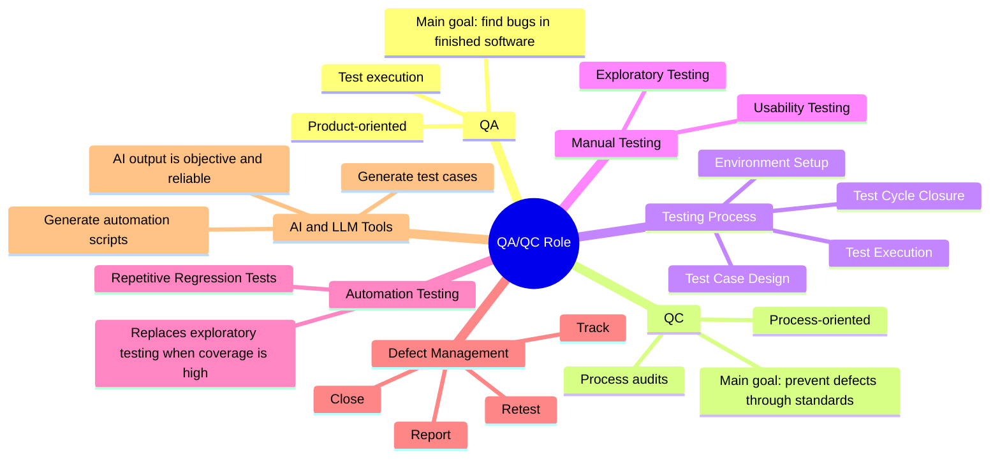

# HW01 — AI Workflow Log

**Môn học:** CSC13003 — Kiểm thử phần mềm  
**Sinh viên:** Tống Dương Thái Hòa  
**MSSV:** 23120262  

---

**You:** *(27/09/2026, 8:00 AM)*  
Read the HW01 assignment and the general Homework Policies. Do not solve the assignment yet. First convert the requirements into an execution checklist from start to finish. Separate Requirement 1 — QA/QC Job Market, Requirement 2 — 20 Software Defects, Requirement 3 — Physical Product Testing, mandatory AI collaboration/audit items, anti-cheat evidence, and Git/submission requirements. For each item, state exactly what artifact must exist at the end and which evidence must be created by me rather than AI.

**ChatGPT (Model Sol 5.6):** *(27/09/2026, 8:01 AM)*  
The assignment should be handled as an evidence-producing workflow rather than only a written report. R1 requires 10 QA/QC job postings published within 60 days, with at least 3 explicitly requiring AI/LLM/AI-assisted automation; each entry needs source link, dated screenshot, job description, required skills, salary information, and 1–2 sentences of AI Impact Analysis. R2 requires 20 public software defects from 2022–2026, including at least 5 directly related to AI/LLM, with source, description, severity, consequence, and solution, plus at least one AI hallucination/bias audit. R3 requires one real household device, device identity evidence, 15 test cases, at least 3 edge cases missed by AI, at least 5 real executions, and short video evidence. AI-generated artifacts must be preserved and audited using VALID / INVALID / INCOMPLETE judgments. Screenshots showing the student's account, physical-device photos, real observations, videos, signatures, and Git history must be student-created evidence.

---

**You:** *(27/09/2026, 8:21 AM)*  
Propose a clean GitHub repository structure for HW01 that makes the assignment easy to audit. Keep Markdown as the main format and keep raw evidence separate from interpreted/report content. Include folders/files for job screenshots, physical-product evidence, video links, the QA/QC mindmap, the test-case workbook, AI Audit, disclosure/checklist forms, and final report.

**ChatGPT (Model Sol 5.6):** *(27/09/2026, 8:22 AM)*  
Recommended structure:

```text
software-testing-hw01-qa-qc-jobs/
├── README.md
├── Report.md
├── log.md
├── QAQC_Role_Mindmap.md
├── QAQC_Role_Mindmap.png
├── Test_Cases_Checklist_Test_Summary.xlsx
├── Video_Links.md
├── Job_Posting_Screenshots/
├── Physical_Product_Evidence/
├── AI_Audit/
│   ├── [AI-02] - FIT@HCMUS - AI Audit Report.md
│   ├── [AI-03] - AI Disclosure Form.*
│   └── [AI-05] - Privacy & Responsible Use Checklist.*
└── final/
```

The main principle is to keep raw evidence immutable and separate from analysis. `Report.md` is the canonical written source, while `log.md` records the AI-assisted workflow.

---

**You:** *(27/09/2026, 8:41 AM)*  
I need 10 QA/QC job postings for HW01. Before collecting them, define an inclusion checklist so I do not accidentally use invalid postings. Requirements: published within 60 days of the submission date, QA/QC/software testing role, at least 3 positions explicitly requiring AI/LLM/AI-assisted automation, capture link, date/age of posting, job description, required skills, salary if available, and screenshots must show my account name. Also define what I must manually verify in LinkedIn before I accept a posting.

**ChatGPT (Model Sol 5.6):** *(27/09/2026, 8:42 AM)*  
A posting should only be accepted when the listing is still accessible, the publication date falls within the required 60-day window, the role is genuinely QA/QC/testing-related, AI classification is supported by explicit job text rather than inference, compensation is copied only when publicly stated, the screenshot contains the relevant posting details and the student's account identity, the original URL is preserved, and duplicate/reposted roles are avoided unless they are clearly distinct positions.

---

**You:** *(27/09/2026, 9:02 AM)*  
I have collected 10 QA/QC job postings. Normalize them into one consistent Markdown schema without inventing missing values. Use Company, Role, Location / working mode, Publication age/date, AI-related: Yes/No, Salary/benefits, Job description summary, Required skills, Source link, and Screenshot path. If salary is not publicly disclosed, explicitly say so.

**ChatGPT (Model Sol 5.6):** *(27/09/2026, 9:03 AM)*  
The ten postings were normalized using one consistent structure. Missing salary information was recorded as **Not disclosed** rather than estimated. Screenshot paths were standardized under `Job_Posting_Screenshots/`, and publication ages were retained as observed values for later final verification against the Moodle deadline.

---

**You:** *(20/09/2026, 9:16 AM)*  
t đã tổng hợp 10 job QA/QC trên linkedIn trong file requirement1.md. với mỗi job, viết cho t 1-2 câu về "AI Impact Analysis" bằng tiếng việt phân tích xem AI đang ảnh hưởng, thay thế hay hỗ trợ kỹ năng gì của vị trí đó.

**Gemini (Gemini 3.6 Flash):** *(20/09/2026, 9:17 AM)*  
AI Impact Analysis was produced for all ten QA/QC positions. The analyses focused on how AI accelerates test ideation, data generation, automation code, log analysis, and evaluation of AI systems, while keeping human responsibility for test strategy, business correctness, risk assessment, release judgment, and validation of AI-generated output.

---

**You:** *(29/09/2026, 1:42 PM)*  
Create a concise QA/QC role mindmap for a Software Testing course. Include QA vs QC responsibilities, the software testing life cycle, manual testing, automation testing, defect management, and the impact of AI/LLM tools. Make it simple enough for a student to review against the course materials.

**ChatGPT (Model Sol 5.6) (model not preserved in original export):** *(29/09/2026, 1:42 PM)*  


---

**You:** *(27/09/2026, 9:23 AM)*  
Audit the raw QA/QC mindmap against the Software Testing course material and ISTQB-style terminology. Do not immediately rewrite it. First identify at least three concrete errors or omissions. For each issue provide the AI statement, verdict VALID / INVALID / INCOMPLETE, why it is wrong or incomplete, and the corrected student version. Pay special attention to QA vs QC orientation, test lifecycle activities, automation limits, and AI reliability.

**ChatGPT (Model Sol 5.6):** *(27/09/2026, 9:24 AM)*  
Three major issues were identified. First, QA and QC were reversed: QA should be process-oriented/preventive, while QC/testing is product-oriented/evaluative, so the baseline was **INVALID** on this point. Second, the testing lifecycle was **INCOMPLETE** because the baseline started at Test Case Design and omitted planning, analysis, and ongoing monitoring/control. Third, the automation/AI claims were **INVALID** because high automation coverage does not replace exploratory testing, and LLM output is not inherently objective or reliable.

---

**You:** *(27/09/2026, 9:44 AM)*  
Rewrite the mindmap after the audit. Final structure must have these major branches: Quality Assurance (QA), Quality Control & Testing, Testing Roles, Test Activities, Test Techniques, Defect Management, and AI-Augmented Testing. Under AI-Augmented Testing, separate AI for Testing, Testing AI Systems, and Human Oversight. Keep the result concise enough to render as a single mindmap.

**ChatGPT (Model Sol 5.6):** *(27/09/2026, 9:45 AM)*  
The corrected mindmap separates QA from QC/testing, distinguishes test activities from test techniques, keeps defect management as a separate lifecycle, and models AI in three roles: AI assisting testing, AI systems as the test target, and human oversight as the final quality/risk authority. The corrected Mermaid structure was then used to produce `QAQC_Role_Mindmap.md` and `QAQC_Role_Mindmap.png`.

---

**You:** *(20/09/2026, 2:21 PM)*  
tìm cho t 20 sự cố phần mềm (software defects) thực tế public từ 2022->2026, trong đó bắt buộc có ít nhất 5 lỗi liên quan trực tiếp đến AI/LLM. mỗi lỗi phải có: link nguồn xác thực, mô tả lỗi, độ nghiêm trọng, hậu quả và giải pháp.

**Gemini (Gemini 3.6 Flash):** *(20/09/2026, 2:22 PM)*  
A candidate list of 20 public software defects/incidents from 2022–2026 was generated, including multiple AI/LLM-related cases. Each candidate contained a source link, description, severity, consequence, and proposed remediation for later verification and normalization.

---

**You:** *(27/09/2026, 10:04 AM)*  
Before finalizing the 20 defects, define a source-validation protocol. Prefer primary/vendor advisories, CVE/CNA records, incident postmortems, or official security disclosures. For every defect check product/vendor identity, CVE number if applicable, affected mechanism, whether severity/CVSS is actually supported, whether the stated consequence follows from the vulnerability, and whether the remediation matches the advisory. If a source does not publish severity, do not invent an official score.

**ChatGPT (Model Sol 5.6):** *(27/09/2026, 10:05 AM)*  
Source priority was defined as vendor advisory or official incident postmortem first, CVE/CNA/NVD second where appropriate, verified researcher disclosure third, and reputable secondary reporting only when primary evidence was unavailable. Severity, CVSS, product identity, impact, and remediation were treated as separate fields that each needed source verification rather than being inferred from technically plausible prose.

---

**You:** *(27/09/2026, 10:25 AM)*  
Review the 20-defect draft one item at a time against its cited source. Flag any row with inconsistent product identity, unsupported severity, incorrect consequence, or remediation that does not match the advisory.

**ChatGPT (Model Sol 5.6):** *(27/09/2026, 10:26 AM)*  
The validation step identified that technically fluent AI explanations can still contain incorrect metadata. One important example involved **CVE-2024-37032**, where the affected product is **Ollama**. Any AI-generated explanation that describes the vulnerability correctly but attributes it to the wrong product must be rejected or corrected before being used in the report.

---

**You:** *(27/09/2026, 10:46 AM)*  
For the assignment I need at least one concrete place where AI hallucinates, becomes biased, or produces an internally inconsistent explanation of a defect. Use one of the current 20 defects and review the AI-generated explanation as an auditor. Return the raw AI claim, what is wrong, evidence used to detect the problem, verdict, and corrected student version.

**ChatGPT (Model Sol 5.6):** *(27/09/2026, 10:47 AM)*  
The audit used the CVE-2024-37032 metadata inconsistency as the example. The technical mechanism could sound plausible while the product identity was wrong. The correct conclusion was that AI output must be independently checked for CVE metadata, vendor/product identity, severity, and remediation. The verdict was **INCOMPLETE / PARTIALLY INVALID** rather than accepting the answer because it sounded technical.

---

**You:** *(27/09/2026, 11:07 AM)*  
Create a concise cross-analysis of the 20 defects. Use mutually exclusive primary categories so the total still equals 20. Then explain the broader lesson across security, QA, and production quality.

**ChatGPT (Model Sol 5.6):** *(27/09/2026, 11:08 AM)*  
The defects were summarized into primary categories such as AI/LLM and AI infrastructure, authentication/authorization, injection/RCE/sandbox escape, information disclosure/arbitrary file read, and operational configuration failure. The cross-analysis emphasized that software quality depends not only on pre-release functional testing but also on secure design, permission boundaries, deployment controls, monitoring, and verification of AI behavior.

---

**You:** *(27/09/2026, 11:27 AM)*  
I will test one real electric pedestal fan. Before writing test cases, list what metadata I must collect from the physical device and what AI is not allowed to invent. The test design may assume a typical mechanical OFF/1/2/3 control and oscillation only as a working hypothesis until I confirm the actual device. Separate device identity evidence, safety pre-check, testable functions, and unknowns that must remain not provided until I inspect the nameplate.

**ChatGPT (Model Sol 5.6):** *(27/09/2026, 11:28 AM)*  
Student-provided metadata should include brand, model, manufacturing year/date if present, serial number with the middle four characters masked, rated voltage/frequency, rated power, a photo of the device with the student ID in the same frame, and a nameplate/serial photo. AI must not invent any of those values. The safety pre-check should cover cord/plug, guard, blade clearance, base stability, height lock, tilt joint, oscillation control, speed/OFF buttons, and abnormal smell/noise/vibration.

---

**You:** *(27/09/2026, 11:48 AM)*  
Generate an initial baseline test suite for a mechanical electric pedestal fan. This is only an AI baseline, not the final student test suite. Focus on normal user behavior and non-destructive tests. Cover power ON/OFF, speeds, oscillation, tilt, height, base stability, continuous operation, and guard/blade clearance. Do not claim that any test was actually executed. Include Objective / Input / Preconditions / Steps / Expected Result. Do not generate Actual Result or Verdict. Keep the baseline to 10 cases so I can later analyze what AI missed.

**ChatGPT (Model Sol 5.6):** *(27/09/2026, 11:49 AM)*  
The AI baseline contained ten normal-path cases: start at Speed 1, change Speed 1 → 2 → 3, OFF from Speed 3, enable oscillation, disable oscillation mid-travel, tilt adjustment/holding, height adjustment/lock, base stability at high speed with oscillation, continuous operation, and blade/guard clearance. No physical result or PASS/FAIL verdict was assigned.

---

**You:** *(27/09/2026, 12:09 PM)*  
Analyze the 10-case AI baseline as a tester. I need at least 3 edge cases that the AI baseline failed to cover. Use course testing ideas such as state transition, boundary/partial input, invalid or ambiguous user actions, and repeated transitions. Tests must be safe and non-destructive, realistic on a mechanical pedestal fan, and must not involve touching live electrical parts. Explain why each is outside the baseline rather than a duplicate.

**ChatGPT (Model Sol 5.6):** *(27/09/2026, 12:10 PM)*  
Five missing edge cases were identified: near-simultaneous speed-button input, half-press of the next speed button, power interruption and restoration while a mechanical speed selector remains latched, releasing oscillation near end-of-travel, and repeated 1 → 3 → 1 speed transitions. These extend the baseline through ambiguous input, boundary state, and repeated state-transition behavior rather than duplicating the normal-path tests.

---

**You:** *(27/09/2026, 12:30 PM)*  
Consolidate the 10 AI-baseline cases and 5 student edge cases into exactly 15 final test cases. Use columns Test ID, Group/domain, Objective, Input, Preconditions, Steps, Expected Result, Actual Result, Verdict, Edge-case type, AI coverage status, Video link, and Notes. Before physical execution, leave Actual Result empty, leave Verdict NOT RUN, label TC-01–TC-10 as AI baseline, and label TC-11–TC-15 as Student edge case / Missed by AI. Expected results must be observable and must not require opening the appliance.

**ChatGPT (Model Sol 5.6):** *(27/09/2026, 12:31 PM)*  
The final specification contained exactly 15 cases with observable oracles such as selector/latch state, airflow/speed change, movement/no movement, abnormal sound, rubbing/contact, instability, visible smoke/sparks, smell, shutdown behavior, and repeatability. TC-01–TC-10 remained AI baseline cases, while TC-11–TC-15 were explicitly identified as student edge cases missed by the AI baseline.

---

**You:** *(27/09/2026, 12:50 PM)*  
Add two supporting sheets around the 15 test cases. Hardware_Checklist should include cord and plug, guard, blade clearance, base, height lock, tilt joint, oscillation control, speed/OFF buttons, nameplate, and abnormal pre-screen. Test_Summary_Report should include device metadata, total cases, AI baseline count, student edge-case count, executed count, PASS/FAIL/BLOCKED/NOT RUN, pass rate, video count, and compliance checks for R3. Do not invent device metadata or physical results.

**ChatGPT (Model Sol 5.6):** *(27/09/2026, 12:51 PM)*  
The workbook was structured into `Test_Cases`, `Hardware_Checklist`, and `Test_Summary_Report`. Planned design, physical observations, and compliance evidence were kept separate so unknown device metadata and unexecuted results could remain explicitly pending.

---

**You:** *(27/09/2026, 1:11 PM)*  
I will now execute the test cases on the real fan. I will give you my observations. Your job is only to rewrite them into concise Actual Result text, assign PASS/FAIL only when the observation clearly satisfies or violates the Expected Result, flag ambiguous cases as needing re-test, and never invent an observation that I did not provide.

**ChatGPT (Model Sol 5.6):** *(27/09/2026, 1:12 PM)*  
Execution results should use four states: **PASS** when observed behavior satisfies the oracle, **FAIL** when a defined expectation is violated, **BLOCKED** when the test cannot proceed safely or the setup is unavailable, and **NOT RUN** when no real execution evidence exists. Sensory evidence such as noise, smell, temperature, vibration, or mechanical behavior must come from the student's actual observation.

---

**You:** *(27/09/2026, 1:32 PM)*  
Normalize my executed observations for TC-11 to TC-15 into report-ready Actual Result statements. Keep them factual and short. Do not overclaim electrical safety. The purpose is to show that the student-derived edge cases were actually testable on the real mechanical controls.

**ChatGPT (Model Sol 5.6):** *(27/09/2026, 1:33 PM)*  
The edge-case observations were normalized as follows: TC-11 resolves to one stable speed state without two buttons remaining latched; TC-12 returns to a valid control state after a partial press/release without a stuck button or abnormal motor behavior; TC-13 stops on external power loss and restarts consistently with the latched selector state when power returns; TC-14 releases oscillation near travel boundary without grinding, jerk, or stuck control; TC-15 completes repeated 1 → 3 → 1 transitions without increasing button stiffness, abnormal noise, or odor.

---

**You:** *(27/09/2026, 1:52 PM)*  
Select at least 5 physical test cases that are easy to demonstrate clearly in videos under 60 seconds. Prefer cases whose Expected Result is visually obvious. The student will record the real video and real voice. For each selected case, give a short recording sequence, what must be visible, one-sentence narration idea, and what must not be staged or AI-generated.

**ChatGPT (Model Sol 5.6):** *(27/09/2026, 1:53 PM)*  
The recommended demonstration set was TC-01, TC-02, TC-04, TC-05, and TC-06 because power/speed, oscillation, and tilt behavior can be shown visually in short clips. The actual fan, user interaction, narration, and observed result must be recorded by the student. AI must not fabricate or simulate the required physical evidence.

---

**You:** *(27/09/2026, 2:13 PM)*  
Consolidate the assignment into one Markdown report without duplicating the raw artifact files. Structure it as: QA/QC Job Market 2026+, 20 Software Defects 2022–2026, Physical Product Testing, AI Audit Summary, AI Critique, Mandatory Disclosure, References, and Self-Assessment. Link to the detailed mindmap and workbook rather than copying every raw field repeatedly. Clearly distinguish confirmed evidence, AI-assisted analysis, assumptions, and pending student evidence.

**ChatGPT (Model Sol 5.6):** *(27/09/2026, 2:14 PM)*  
`Report.md` was consolidated with ten job subsections, a job-market synthesis, twenty defect subsections, a defect cross-analysis, physical-device metadata/evidence status, a concise 15-case test table, video execution section, AI audit summary, AI critique, disclosure, references, and self-assessment. Pending evidence remained explicitly marked instead of being silently filled.

---

**You:** *(27/09/2026, 2:34 PM)*  
Build the AI Audit around artifacts rather than around every sentence in the report. Use these four audit units: R1 raw QA/QC mindmap, R2 defect register + AI explanation audit, R3 initial physical-product test suite, and workbook/report consolidation. For each unit use Prompt + tool + timestamp/status, AI output, Verdict VALID / INVALID / INCOMPLETE, Reasoning grounded in course material or reliable source, and Student fix. Do not label an artifact VALID just because its formatting is good.

**ChatGPT (Model Sol 5.6):** *(27/09/2026, 2:35 PM)*  
The audit treated each artifact by correctness and completeness. The R1 raw mindmap was partially invalid/incomplete, the R2 defect register remained incomplete until source verification, the R3 initial suite was incomplete because it missed edge cases, and workbook/report consolidation was incomplete wherever required student evidence was absent. The audit therefore evaluated substance rather than presentation quality.

---

**You:** *(27/09/2026, 2:55 PM)*  
For the AI Audit conclusion, explain how to calculate the VALID / INVALID / INCOMPLETE ratio. Do not fabricate percentages if the audit-unit count is not frozen yet. State the formula and leave final percentages to be calculated from the actual audited entries.

**ChatGPT (Model Sol 5.6):** *(27/09/2026, 2:56 PM)*  
Use:

```text
VALID %      = VALID entries / total audited entries × 100
INVALID %    = INVALID entries / total audited entries × 100
INCOMPLETE % = INCOMPLETE entries / total audited entries × 100
```

The denominator must be the actual frozen number of audit entries, and mixed verdicts should be resolved consistently at the chosen audit granularity.

---

**You:** *(27/09/2026, 3:15 PM)*  
Write a 200–300 word AI Critique based only on failures actually observed in this HW. It must discuss the QA/QC mindmap errors, defect metadata/source verification, missed physical-device edge cases, why LLM pattern completion causes these weaknesses, and a practical principle for human-AI collaboration in testing. Do not write generic AI ethics filler.

**ChatGPT (Model Sol 5.6):** *(27/09/2026, 3:16 PM)*  
The critique concluded that AI was effective for baseline generation, structure, normalization, and test ideation, but unreliable as the final factual authority, the physical test oracle, the source of anti-cheat evidence, or the owner of safety/release decisions. The mindmap reversal, defect metadata inconsistency, and missed edge cases were used as concrete evidence for the principle that AI output should be treated as a draft to verify rather than as a trusted final answer.

---

**You:** *(27/09/2026, 3:36 PM)*  
Draft the Mandatory Disclosure for this assignment. Declare AI assistance for mindmap baseline and final image rendering, defect research organization, test-case ideation, workbook/report editing. Explicitly state that job screenshots/account identity, physical device and student-ID photo, nameplate/serial evidence, real observations and Actual Results, video/voice, and signatures are student-created. Do not claim that evidence exists if it is still pending.

**ChatGPT (Model Sol 5.6):** *(27/09/2026, 3:37 PM)*  
A disclosure was prepared that separates AI-assisted reasoning, organization, and formatting from student-created evidence. It also states that the AI Audit appendix documents corrections and limitations rather than presenting AI output as independently verified fact.

---

**You:** *(27/09/2026, 3:57 PM)*  
Self-assess the current repository against the final HW01 rubric. Be conservative: award full points only when evidence exists, reduce points for missing account-name screenshots, missing physical-product metadata/photo, missing video URLs/signatures, and do not treat planned artifacts as completed. Explain each deduction.

**ChatGPT (Model Sol 5.6):** *(27/09/2026, 3:58 PM)*  
The current conservative self-assessment was recorded as:

| Criterion | Max | Self-assessed |
|---|---:|---:|
| Job Market 2026+ | 40 | 34 |
| 20 Software Defects | 20 | 20 |
| Physical-product testing | 25 | 21 |
| AI-02 | 8 | 8 |
| AI Critique + AI-03 | 4 | 4 |
| AI-05 + anti-cheat | 3 | 1 |
| **Total** | **100** | **88** |

The main deductions were evidence-completeness issues rather than conceptual testing-design issues.

---

**You:** *(27/09/2026, 4:18 PM)*  
Audit the current final artifacts one last time and list only the blocking or high-risk items that still need my manual action before submission. Cross-check Report.md, QAQC_Role_Mindmap.md / PNG, Test_Cases_Checklist_Test_Summary.xlsx, job screenshots, physical-product evidence, Video_Links.md, AI-02 / AI-03 / AI-05, and Git history. Use PASS / PARTIAL / BLOCKED.

**ChatGPT (Model Sol 5.6):** *(27/09/2026, 4:19 PM)*  
R1 content was **PARTIAL** until account/date visibility in screenshots is manually confirmed. R1 mindmap was **PASS** because raw AI output, three identified issues, corrected content, and PNG exist. R2 was structurally **PASS**, subject to final source-link accessibility checks. R3 test design was **PASS**, while physical-product evidence and video evidence were **PARTIAL/BLOCKED** until the required photo, device metadata, and at least five real video URLs are added. AI-02, AI-03, and AI-05 remained **PARTIAL** until finalization/signature. Git history had to be checked against the real repository because AI must not fabricate historical commits.

---

**You:** *(27/09/2026, 4:38 PM)*  
Give me a commit plan that maps one meaningful commit to each major completed step. Do not fabricate commit hashes or timestamps. Keep commit messages explicit enough for the lecturer to understand the progression.

**ChatGPT (Model Sol 5.6):** *(27/09/2026, 4:39 PM)*  
Suggested commit sequence:

```text
chore: initialize HW01 repository and artifact structure
docs(r1): add 10 QA QC job posting evidence and summaries
docs(r1): add AI impact analysis for job postings
docs(r1): add raw QA QC mindmap and student corrections
docs(r2): add 20 software defect register with verified sources
docs(r2): add AI hallucination audit and cross-defect analysis
test(r3): add physical fan AI baseline test cases
test(r3): add student edge cases and safety checklist
test(r3): record physical execution results
docs(r3): add video evidence references
docs(ai): add AI audit critique and disclosure
docs: consolidate final report and self assessment
chore: finalize submission package
```

These are recommended commit messages only. They are not a replacement for the repository's real Git history.

---

**You:** *(27/09/2026, 4:59 PM)*  
Give me the final packaging procedure for submission. Requirements: Markdown remains the source, export a Save-As-PDF copy, include required artifact files, use the required zip naming format, check file-size/count limits, and verify GitHub links and evidence links before Moodle submission. Do not mark the assignment complete until manual evidence is present.

**ChatGPT (Model Sol 5.6):** *(27/09/2026, 5:00 PM)*  
Final procedure: fill student identity and real device metadata; verify all ten job screenshots; add device + student-ID photo; add masked nameplate/serial evidence; add at least five real video URLs; complete AI-03 and AI-05; freeze AI-02 and calculate the final audit ratio; remove remaining placeholders; validate source URLs; check `git log`; push the final repository; export `Report.md` to PDF; name the archive using `StudentID_ExerciseID_SelfAssessedGrade.zip`; check Moodle size/file-count limits; open the exported PDF to verify layout; then submit through Moodle.
