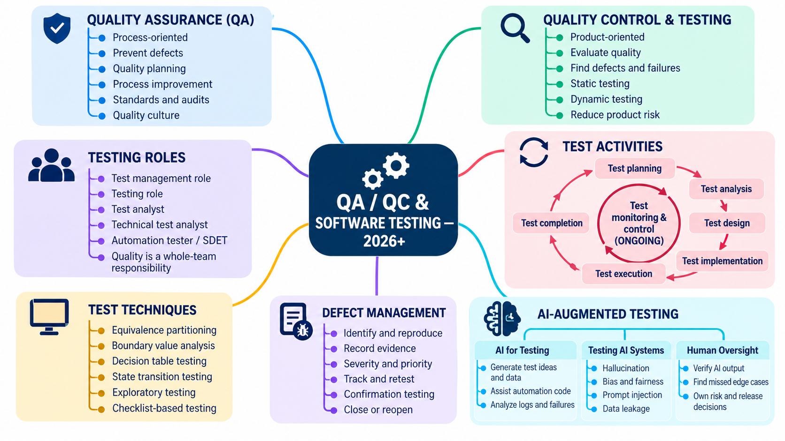
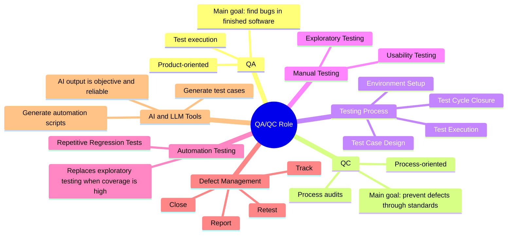
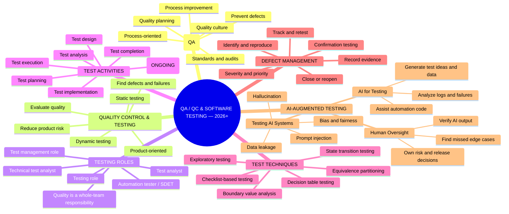

# Mindmap vai trò QA/QC — Software Testing 2026+

**Môn học:**  CSC13003 — Kiểm thử phần mềm  
**Họ và tên:** Tống Dương Thái Hòa  
**MSSV:** 23120262  

## 1. Prompt và raw AI output

**Timestamp được ghi trong draft:** 13:42, 29/09/2026

**Prompt**

> Create a concise QA/QC role mindmap for a Software Testing course. Include QA vs QC responsibilities, the software testing life cycle, manual testing, automation testing, defect management, and the impact of AI/LLM tools. Make it simple enough for a student to review against the course materials.

## 2. Ba lỗi/sự thiếu sót được phát hiện

### 2.1. Đảo QA và QC

- **AI statement:** QA là product-oriented và chủ yếu tìm bug; QC là process-oriented và ngăn defect bằng standards.
- **Verdict:** **INVALID**.
- **Reasoning:** Với mô hình khái niệm dùng trong bài, QA thiên về quy trình, phòng ngừa, planning, improvement và audit; QC/testing thiên về đánh giá sản phẩm, phát hiện defect/failure bằng static và dynamic testing. Tên chức danh thực tế có thể dùng không thống nhất, nhưng không làm thay đổi sự phân biệt học thuật cần thể hiện.
- **Student fix:** sửa nhánh QA thành process-oriented/preventive; sửa nhánh QC & Testing thành product-oriented/evaluative.

### 2.2. Thiếu các test activity đầu vòng đời và tính liên tục của monitoring/control

- **AI statement:** quy trình bắt đầu ở Test Case Design rồi đến Environment Setup, Execution và Closure.
- **Verdict:** **INCOMPLETE**.
- **Reasoning:** ISTQB CTFL v4.0.1 mô tả các nhóm hoạt động gồm test planning, monitoring and control, analysis, design, implementation, execution và completion. Monitoring/control không phải một bước chỉ chạy một lần mà diễn ra xuyên suốt để so sánh tiến độ với plan và điều chỉnh khi cần.
- **Student fix:** thể hiện chu trình `Planning → Analysis → Design → Implementation → Execution → Completion`, với `Monitoring & Control (ongoing)` ở trung tâm.

### 2.3. Overclaim khả năng thay thế con người của automation/AI

- **AI statement:** automation thay thế exploratory testing khi coverage cao; AI output khách quan và đáng tin cậy.
- **Verdict:** **INVALID**.
- **Reasoning:** Automated test chỉ lặp lại oracle đã được mã hoá; coverage cao vẫn có thể bỏ sót unknown risks hoặc sử dụng expected result sai. LLM có thể hallucinate, bias, bị prompt injection hoặc làm rò dữ liệu. Vì vậy người dùng vẫn phải xác minh output, tìm edge case và chịu trách nhiệm cho quyết định risk/release.
- **Student fix:** tách rõ ba nhánh `AI for Testing`, `Testing AI Systems` và `Human Oversight`.

## 3. Mindmap chuẩn đã sửa

## 4. Quan hệ giữa các nhánh

QA thiết lập và cải tiến hệ thống chất lượng; QC/testing cung cấp bằng chứng về chất lượng sản phẩm. Các testing role thực hiện test activities bằng test techniques thích hợp, ghi nhận failure thành defect và theo dõi đến khi confirmation testing cho phép đóng hoặc phải reopen. AI hỗ trợ ideation, coding và phân tích, đồng thời tự nó tạo thêm đối tượng cần kiểm thử.  Vì vậy human oversight là quality gate bắt buộc, không phải phần trang trí.